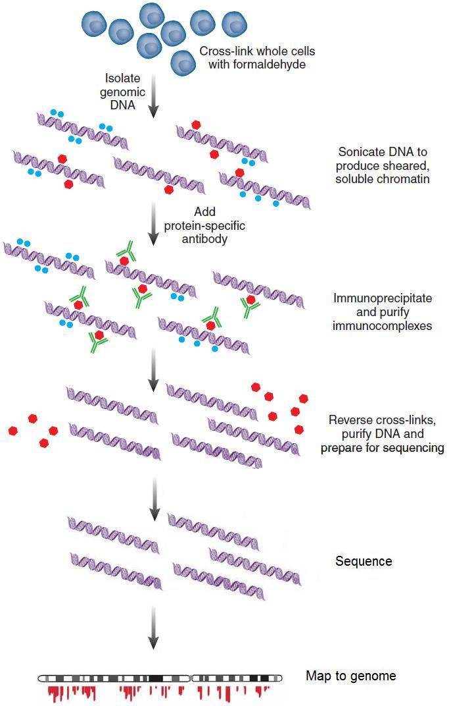
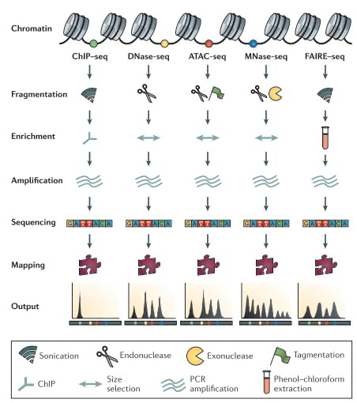
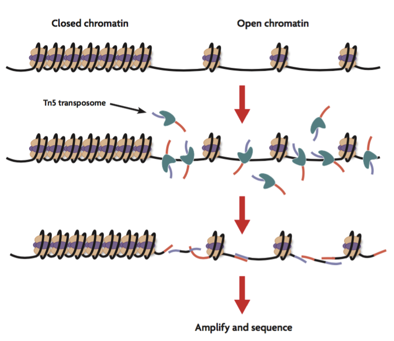
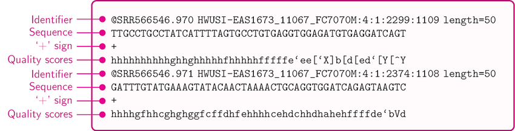
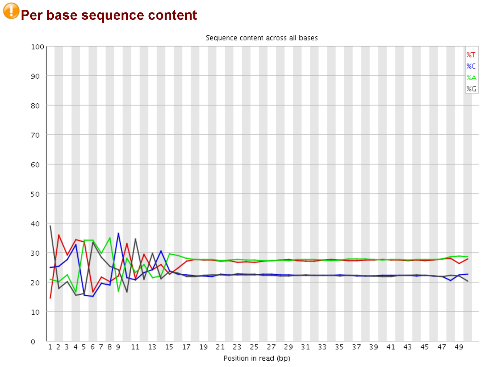
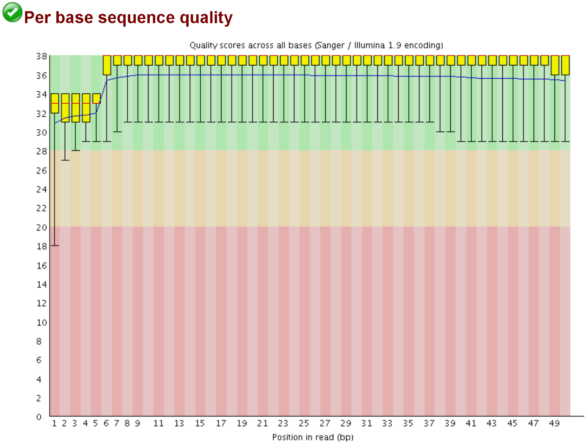
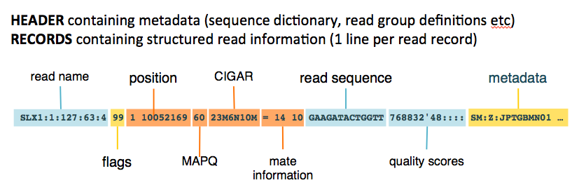
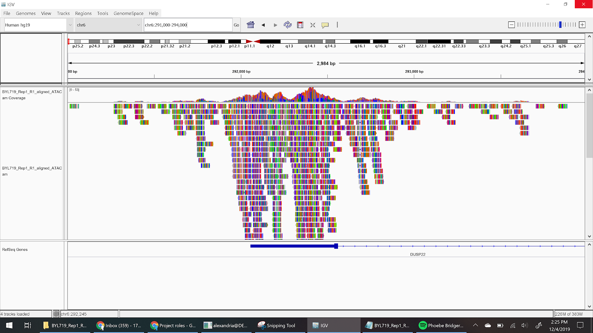
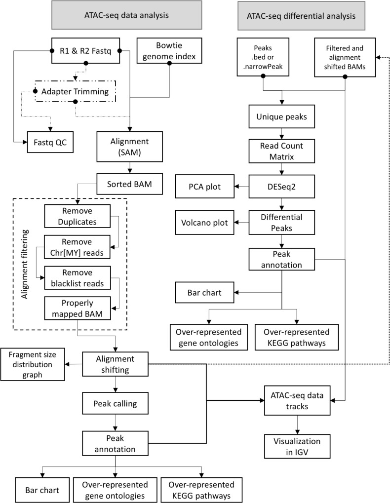

# ATAC-seq and its Related Biology and Computational Methods

## Functional features of the genome.

### Chromatin Organization and Nucleosomes
A nucleosome is a unit of DNA packaging, consisting of a segment of DNA wound around eight histone protein cores. This forms a histone octamer. A histone octamer contains two copies each of the histone proteins H2A, H2B, H3, and H4 [[1]](https://www.nature.com/scitable/definition/nucleosome-nucleosomes-30/).

Genetic expression regulation is partly reliant on the chemical modifications on histones. DNA tightly wraps around histones because they hold a positive charge that attracts the negatively charged DNA strand. Histones have long amino acid tails that influence chromatin accessibility, and chemical groups added to the tails such as methylation or acetylation, can influence how these tails wrap around and cover the DNA.  
Methylation: It is often associated with gene inactivation, but some modifications play crucial roles in DNA repair and dynamic regulation. A common modification is the tri-methylation of the histone H3 on the 4th residue from the N-terminus which is a lysine (K). Abbreviated, this is known as the H3K4me3. Other well-known modification sites are H3K9, H3K27, H3K36, H3K79 and H4K20 [[2]](https://www.ncbi.nlm.nih.gov/pmc/articles/PMC4073795/).
Acetylation: It is often associated with gene activation due to its involvement in transcriptional elongation. Sites of interest are H3K36 and H4K16 [[3]](https://epigenie.com/epigenie-learning-center/epigenetics/histone-acetylation-and-genome-function/).

### Insulators
Insulators are 300 to 2000 bp DNA sequences located close to promoters that are responsible for mediating intra and inter chromosomal interactions. By creating loops and causing nucleosome modifications, insulators act as enhancer-blockers or barriers or both. Essentially, their main purpose is to isolate the regulation of close proximity genes from each other. ATAC seq may help infer insulator locations by revealing the locations where DNA loops are formed. Perhaps if we know that a loop occurs close to a promoter sequence, we can postulate that the loop is an insulator. 

### Regulatory sequence elements
Proximal to coding genes are promoter and silencer sequences, with enhancers located further away on the strand, but proximal due to DNA looping. Transcription factors (TFs) regulate gene expression by interacting with binding sites of these sequences. TFs know where to bind by looking for DNA-binding motifs, which are specific short sequences for which the factor has a high binding affinity. Once bound TFs often recruit other TFs and RNA polymerase to bind. 

## Genetic expression: why we study the epigenome
Beyond DNA sequencing and RNA sequence quantification for genetic expression levels, it is important to understand the mechanisms for transcription regulation and how they affect genetic expression. Genes are largely regulated by transcription factors that bind in close proximity to them and either enhance expression by recruiting RNA polymerase for transcript elongation or inhibit expression by preventing other TFs or polymerase from binding to that region of the DNA. It is interesting to find motif sequences for which TFs have high affinity because we can infer a broad range of functions that the TF regulates and predict if nearby genes are implicated in TF action [[4]](https://www.cell.com/cell/fulltext/S0092-8674(18)30106-5?_returnURL=https://linkinghub.elsevier.com/retrieve/pii/S0092867418301065?showall=true).

However, transcription factor activity cannot occur without access to open chromatin, not tightly packed around nucleosomes. It is useful to use methods that cut unprotected DNA to analyze the areas that are protected by nucleosome packing or by bound transcription factors. What genes are active in muscle cells that are not active in neurons? What genes are activated when a cell is under stress? When it is pre-cancerous? Assays for epigenetic structure help to answer these questions. 

## Previous Methods For Genome Wide Assays of Epigenetic Structure

### ChIP seq
  
(from Lecture 6_ChIP-seq-KN slides)
A technique for location the regions where a specific DNA-binding protein (like a transcription factor) interacts with DNA. First, crosslink the protein with the DNA using a substance like formaldehyde, add protein specific antibodies with magnetic regions, shear the DNA and pull down with streptavidin (this technique is called immunoprecipitation). Finally, reverse the cross links and sequence the DNA you have pulled down [[5]](https://www.ncbi.nlm.nih.gov/pmc/articles/PMC3431496/).

### HI - C
  
(from Lecture 7_Genome-interaction-Hi-C-KN slides)
Which genomic positions are physically close together in the nucleus? Used to figure out what pairs of DNA strands form the anchors for chromatin loops. First, the loops are held in place by adding formaldehyde to the cells, which covalently links chromatin segments that are close to each other. Next, restriction enzymes are used to cut away the parts of the loop outside the anchors. Fill the sticky ends of the anchor sequences and mark the ends with biotin. DNA ends that are close to each other will be ligated; the ligation mainly happens only to the anchor sequences because of the proximity requirement. Cut off ends of DNA which are not ligated so that they do not contain biotin, and pull down the anchors by attracting the biotin with streptavidin. Shear the anchor DNA, do PCR to make more genetic material, and perform sequencing. Trim and remap signature during the data analysis to make sure you do not have extra nucleotides from outside the anchor sequences [[6]](https://www.ncbi.nlm.nih.gov/pmc/articles/PMC3149993/).

  
[Figure 1:](https://www.nature.com/articles/nrg3788) Comparison between experimental tools for primary-order structure detection. Figure by Meyer, Clifford A.et al., Nature Reviews Genetics 15.11(2014):709-721
### FAIRE-seq
A method for finding regions of DNA associated with regulatory activity. DNA is cross linked to preserve its interactions, then sonicated. After sonication, the cross linking is removed using a phenol-chloroform extraction. When the cross linking is removed, chromatin associated with nucleosomes will remain in its organic state while the other DNA will prefer being aqueous. The assay then selects for the aqueous DNA in order to perform functional enrichment for the nucleosome depleted regions of the DNA and sequence those regions. Regulatory DNA segments are often characterized by an eviction of nucleosomes, so sequencing nucleosome poor regions will select for regulatory sequences [[7]](https://www.ncbi.nlm.nih.gov/pmc/articles/PMC1891346/).

### MNase
Maps locations of nucleosomes by digesting areas of DNA that are not wrapped around histones with Micrococcal Nuclease and sequencing the undigested areas [[8]](https://currentprotocols.onlinelibrary.wiley.com/doi/full/10.1002/0471142727.mb2101s69).

### DNase-seq
Maps locations of nucleosomes by digesting areas of DNA that are not wrapped around histones with DNase I and sequencing the undigested areas [[9]](https://www.ncbi.nlm.nih.gov/pmc/articles/PMC3627383/).

# ATAC-seq

[Figure 2:](https://www.activemotif.com/blog-atac-seq) Visualization of ATAC seq action on DNA. Figure by Active Motif, Complete Guide to Understanding and Using ATAC-seq 

ATAC-Seq stands for Assay for Transposase-Accessible Chromatin with high-throughput sequencing. It is used for mapping chromatin accessibility genome-wide. 

## Library Preparation Process
### Cell prep
During harvesting cells should be intact and in a homogenous single cell suspension. Making sure to have between 25k to 75k cells is important. Using too few cells causes over-digestion of chromatin later on. This creates more noisy data. Using too many cells results in under-digestion. This creates large fragments that can be hard to sequence. After harvesting, cells are lysed with a nonionic detergent to yield pure nuclei [[10]](https://www.ncbi.nlm.nih.gov/pmc/articles/PMC4374986/).

### Transposition Reaction
The yielded nuclei is then fragmented using Tn5 transposase through a process known as tagmentation. Tn5 also adds sequencing adapters to the end of chromatin where it forms a break. The resulting fragments constitute an ATAC-Seq library. The library undergoes purification to only include the DNA from the samples [[11]](https://www.ncbi.nlm.nih.gov/pmc/articles/PMC4374986/).
The purified library can be amplified by PCR so that it can be analyzed by other methods such as qPCR or next-generation sequencing.

## Computational Analysis
### The steps:
Raw read quality: check the sequencing output for the base pair quality and do any necessary read trimming
Alignment to a reference genome: map the reads to a reference genome for the organism studied
Alignment quality and filtering: check the quality of the mapping
Peak calling: highlight areas with high density of mapped reads
Differential peak analysis: compare selected areas between samples

We will be providing some alternate programs for each step

### Step 1: Raw read quality
Out of sequencing machines, the data is often very “noisy”. They come in the format of a FASTQ file, each read with its own identifier tag, sequence, quality string, and a delimiter (normally a “+”) to separate it from the next read. The bases do not come out with 100% accuracy, and the machine will assign a Phred quality score, represented by one ASCII character per nucleotide, to each nucleotide based on its confidence that it correctly identified that base. 

  
The reads can also come with “adaptor” sequences still attached to the ends. Adaptors can be added to the end of DNA fragments to help identify the samples they originate from and to hybridize them to the flowcells of the sequencing machine for the sequencing process. FASTQC will detect these as a warning in “per base sequence content”, as the bases at the start of a read will be biased away from the expected approximate 25% frequency do to the inclusion of these. In addition, the restriction (cut) sites of the transposase will also introduce bias which is expected and does not need to be fixed. 

These adaptors and the low quality read fragments need to be trimmed away as they will interfere with the alignment step and cause the reads to map to erroneous areas of the genome or to not map at all. In addition, the restriction (cut) sites of the transposase will also introduce bias which is expected and does not need to be fixed. Some useful trimming tools are cutadapt and Trimmomatic. 

### Step 2: Alignment
To be able to analyze what areas of the genome our ATAC-seq reads came from, we need to align them to a reference genome that comes with an annotation. Thus, we will need the FASTQ from the last step, a FASTA file of the reference genome, and the reference GTF or GFF3 file. In this step, the alignment tool will compare each read to the genome and will match it to the right chromosome and position. The algorithm for this will vary across tools, with more specificity often taking more time. Many of the robust methods include a Burrows-Wheeler Algorithm for genome indexing, which adds numeric labels to the reference genome to help guide reads more efficiently. These include BWA and BowTie2, which have the best mapping rates in most cases. Another method is Stampy, which is faster and more tolerant of variants from the reference, so it is useful to consider it if the organism sampled deviates from the reference genome significantly. These programs will output a file in sequence alignment map (SAM) format, or BAM which is the binary compressed version. 

  
[Figure 3:](https://gatkforums.broadinstitute.org/gatk/discussion/11014/sam-bam-cram-mapped-sequence-data-formats) Basic structure of the SAM format. Figure by Genome Analysis Toolkit, SAM / BAM / CRAM - Mapped sequence data formats. 

### Step 3: Alignment quality filtering
Reads that originate from the same fragment of DNA (duplicates) must be marked in the SAM file as we do not want to double count them when looking for peaks. Picard MarkDuplicates is a tool that is useful for this. Picard is an entire suite of the genome analysis tools generated by the reputable Broad Institute to do a variety of functions. 

### Step 4: Peak calling
Now that all the reads are mapped to the reference genome, they can be stacked up for every chromosomal position and counted [[12]](https://www.ncbi.nlm.nih.gov/pubmed/22517427). Interactive Genome Viewer (IGV , below) can be used to visualize these peaks, but we will want to use software to identify them all. A common program for this is MACS2. It takes a BAM file and will output a BED file, which contains information about the location and gene annotations of peaks. MACS2 models the expected fragment sizes and uses a Poisson distribution to capture biases so it can more sensitively and robustly detect real peaks against background noise [[13]](https://genomebiology.biomedcentral.com/articles/10.1186/gb-2008-9-9-r137#citeas).
  

### Step 5: Differential peak analysis
To compare different epigenomic states across samples, we compare the size and location of peaks to see the genes whose accessibilities differ. There are two different approaches:
Evaluating peaks and the individual genes on which they map.
Evaluating the functions of genes for the differing peaks. 
R is a programming language built for scripting, specifically with an emphasis on mathematics and data science. This makes it a common tool for bioinformatics analysis, and many modules built are integrated into a package called bioconductor. For analyzing the peaks, there needs to be a list generate of peaks and the number of reads mapped to each for each sample. This can be done using the Rsubread of the R bioconductor package. DESeq2, another bioconductor package, calculate the changes in mapped read counts for peaks for each gene and calculate the statistical significance of each. These changes correspond to changes in chromatin openness or closeness on that gene. 

Aside from looking at individual genes, it is also useful to look at gene functions that are “enriched”, more highly expressed. Functional enrichment analysis can be done using gene ontology (GO), a set of terms to categorize and build a network of gene functions. Another representation of biomolecular interactions is Kyoto Encyclopedia of Genes and Genomes (KEGG) pathways. The ChIPpeakAnno bioconductor package can be used for this. Many of the bioconductor tools were written for peak calling for ChIP-seq but are just as effective for analyzing ATAC-seq peaks as the input data formats are the same. 

### A wrapper to sum it all up
A “wrapper” program is one that puts other well-known gold-standard programs together in sequence with the right settings so the user only needs to make one command to the wrapper program as a whole. This makes analysis more accessible to those without bioinformatics expertise, but we can separate the steps and do more finetuning, and even swap some programs to fine tune it to our experiments. Recently, GUAVA has been developed to provide a convenient user interface for ATAC-seq analysis and generate visuals and annotations. They provide an excellent flowchart to summarize the entire workflow. 
Their steps and tools:
Raw read quality: FASTQC and CutAdapt
Alignment to a reference genome: BowTie2
Alignment quality and filtering: Picard MarkDuplicates, SAMTools
Intermediate steps:
Alignment shifting: A GUAVA-specific script. The Tn5 transposase cuts open chromatin regions with two cuts that are separated by 9 bp, forming a sticky end . Thus, the reads aligning to the positive and negative strand need to be adjusted by +4 bp and -5 bp, respectively, to represent the center of the transposase binding site.
Analysis of fragment size distribution: Picard CollectInsertSizeMetrics. Checks the quality of the ATAC-seq library since a good fragment size distribution graph should have sharp two peaks at less than 100 base pairs (bp) from the open chromatin and at  about ∼200 bp for mono-nucleosomes and smaller peaks representing di-nucleosomes and tri-nucleosomes. 
Peak calling: MACS2
Differential peak analysis: DESeq2 R package
Peak functional annotation: ChIPpeakAnno R package

  
## Comparing Methods

Compared to DNase-seq, FAIRE-seq, and MNase-seq ATAC-seq has two common advantages. 
I. It can be performed with significantly fewer cells. Only requires about 50,000 cells compared to the millions needed by other methods. 
II. Library prep is faster and less step intensive compared to previous methods [[14]](https://www.ncbi.nlm.nih.gov/pmc/articles/PMC6391789/).

However, ATAC-seq is nor the best technology to use in all cases. When looking at nucleosome distribution MNase-seq strategy of cutting up the DNA between nucleosomes produces strong peaks for nucleosomes. Looking at the gaps between ATAC-seq’s peaks to determine nucleosome location is less effective because Tn5 struggles to cut in between the small gaps between nucleosomes.

ATAC-seq and DNase-seq are the only tools that can be used to find both transcription factor binding sites and chromatin accessibility. ChIP-seq shows binding site locations but not accessibility. FAIRE-seq shows accessibility, but not the binding site [[15]](https://epigeneticsandchromatin.biomedcentral.com/articles/10.1186/1756-8935-7-33).

In a study that compared ATAC-seq to FAIRE-seq, ATAC-seq was found to also have a higher signal-to-noise ratio, with low background signal and sharper peaks (Fig. E and F). Furthermore, ATAC-seq showed a higher recall of true enhancers than FAIRE-seq, detecting ∼18.75% more enhancers ,even at similar levels of specificity (Fig. G). 

[Figure 4:](https://journals.plos.org/plosgenetics/article?id=10.1371/journal.pgen.1004994) Comparison between FAIRE-seq and ATAC-seq. Figure by Davie, Kristofer et al., Discovery of Transcription Factors and Regulatory Regions Driving In Vivo Tumor Development by ATAC-seq and FAIRE-seq Open Chromatin Profiling.

**Citations**
1. nucleosome / nucleosomes. Nature News Available at: https://www.nature.com/scitable/definition/nucleosome-nucleosomes-30/.
2. Greer, E. L. & Shi, Y. Histone methylation: a dynamic mark in health, disease and inheritance. Nature reviews. Genetics (2012). Available at: https://www.ncbi.nlm.nih.gov/pmc/articles/PMC4073795/.
3. Histone Acetylation and Genome Function  EpiGenie Available at: https://epigenie.com/epigenie-learning-center/epigenetics/histone-acetylation-and-genome-function/.
4. Lambert, S. A. The Human Transcription Factors. (2018). Available at: https://www.cell.com/cell/fulltext/S0092-8674(18)30106-5?_returnURL=https://linkinghub.elsevier.com/retrieve/pii/S0092867418301065?showall=true.
5. Landt, S. G. et al. ChIP-seq guidelines and practices of the ENCODE and modENCODE consortia. Genome research (2012). Available at: https://www.ncbi.nlm.nih.gov/pmc/articles/PMC3431496/.
6. Berkum, N. L. van et al. Hi-C: a method to study the three-dimensional architecture of genomes. Journal of visualized experiments : JoVE (2010). Available at: https://www.ncbi.nlm.nih.gov/pmc/articles/PMC3149993/.
7. Giresi, P. G., Kim, J., McDaniell, R. M., Iyer, V. R. & Lieb, J. D. FAIRE (Formaldehyde-Assisted Isolation of Regulatory Elements) isolates active regulatory elements from human chromatin. Genome research (2007). Available at: https://www.ncbi.nlm.nih.gov/pmc/articles/PMC1891346/.
8. Zaret, K. Micrococcal Nuclease Analysis of Chromatin Structure. Current Protocols (2005). Available at: https://currentprotocols.onlinelibrary.wiley.com/doi/full/10.1002/0471142727.mb2101s69.
9. Song, L. & Crawford, G. E. DNase-seq: a high-resolution technique for mapping active gene regulatory elements across the genome from mammalian cells. Cold Spring Harbor Protocols (2010). Available at: https://www.ncbi.nlm.nih.gov/pmc/articles/PMC3627383/.
10. Buenrostro, J. D., Wu, B., Chang, H. Y. & Greenleaf, W. J. ATAC-seq: A Method for Assaying Chromatin Accessibility Genome-Wide. Current protocols in molecular biology (2015). Available at: https://www.ncbi.nlm.nih.gov/pmc/articles/PMC4374986/.
11. Buenrostro, J. D., Wu, B., Chang, H. Y. & Greenleaf, W. J. ATAC-seq: A Method for Assaying Chromatin Accessibility Genome-Wide. Current protocols in molecular biology (2015). Available at: https://www.ncbi.nlm.nih.gov/pmc/articles/PMC4374986/.
12. Thorvaldsdóttir, H., Robinson, J. T. & Mesirov, J. P. Integrative Genomics Viewer (IGV): high-performance genomics data visualization and exploration. Briefings in bioinformatics (2013). Available at: https://www.ncbi.nlm.nih.gov/pubmed/22517427.
13. Zhang1, Y. et al. Model-based Analysis of ChIP-Seq (MACS). Genome Biology (2008). Available at: https://genomebiology.biomedcentral.com/articles/10.1186/gb-2008-9-9-r137#citeas.
14. Li, Z. et al. Identification of transcription factor binding sites using ATAC-seq. Genome biology (2019). Available at: https://www.ncbi.nlm.nih.gov/pmc/articles/PMC6391789/.
15. Buck1, M. J. Chromatin accessibility: a window into the genome. Epigenetics & Chromatin (2014). Available at: https://epigeneticsandchromatin.biomedcentral.com/articles/10.1186/1756-8935-7-33.

**Figures**
1. Meyer, C. A. & Liu, X. S. Identifying and mitigating bias in next-generation sequencing methods for chromatin biology. Nature News (2014). Available at: https://www.nature.com/articles/nrg3788.
2. Complete Guide to Understanding and Using ATAC-Seq. Active Motif Available at: https://www.activemotif.com/blog-atac-seq.
3. GATK_Team. SAM / BAM / CRAM - Mapped sequence data formats. GATK (2017). Available at: https://gatkforums.broadinstitute.org/gatk/discussion/11014/sam-bam-cram-mapped-sequence-data-formats.
4. Davie, Kristofer et al. Discovery of Transcription Factors and Regulatory Regions Driving In Vivo Tumor Development by ATAC-seq and FAIRE-seq Open Chromatin Profiling. PLOS Genetics (2015). Available at: https://journals.plos.org/plosgenetics/article?id=10.1371/journal.pgen.1004994
