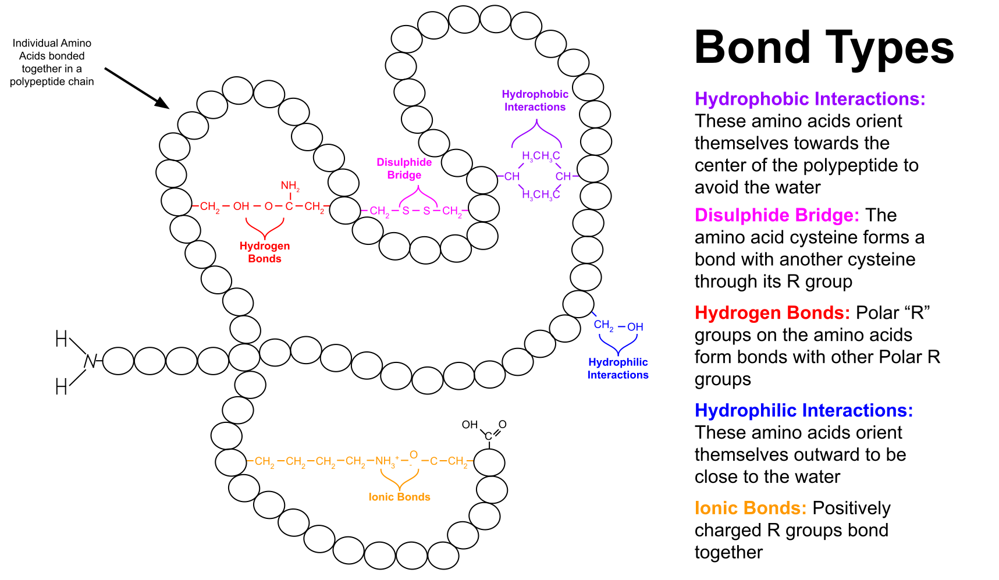
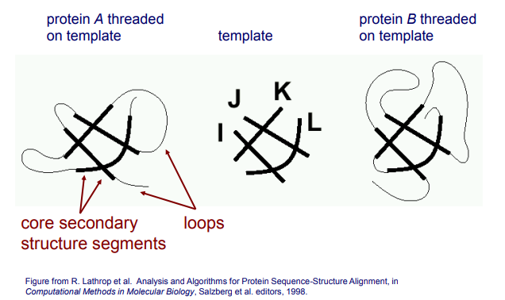
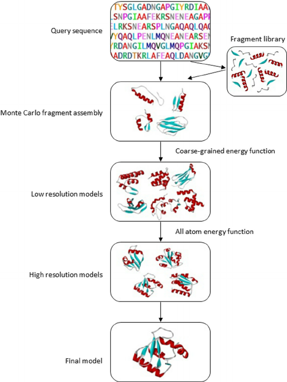
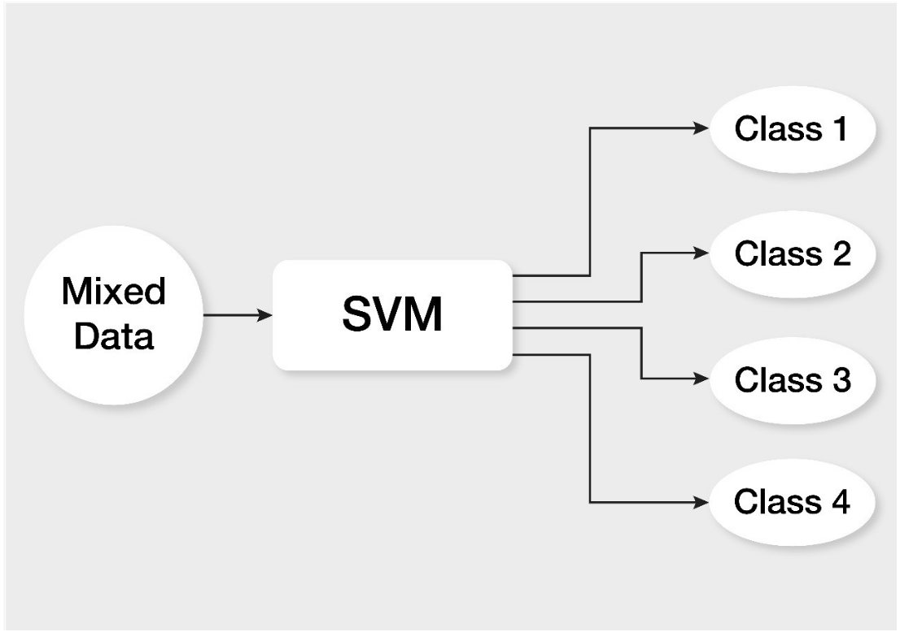
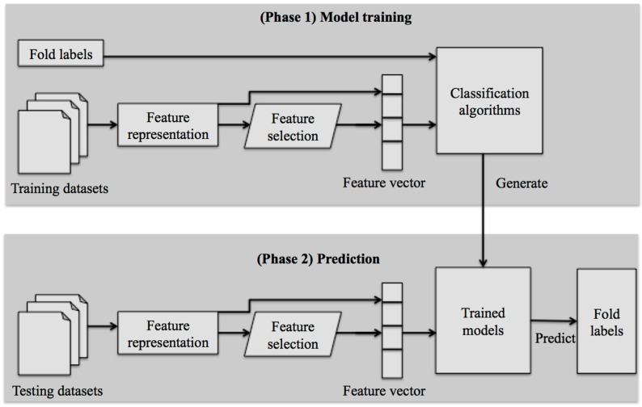
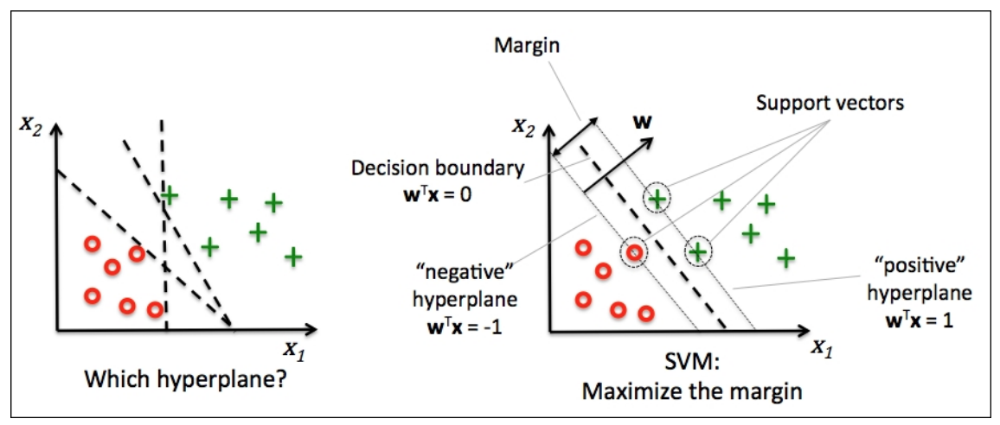

1. [Introduction for Protein Folding](#sec-01)
2. [Structural Components of Proteins](#sec-02)
3. [Predicting Protein Structures](#sec-03)
4. [Template-Based Structure Modeling](#sec-04)
5. [Protein Threading](#sec-05)
6. [De novo Protein Structure Prediction](#sec-06)
7. [Using Machine Learning](#sec-07)
8. [Comparison of Computational Methods](#sec-08)

## Introduction to Protein Folding {#sec-01}

{width=50%}

Proteins are involved in nearly every biological process in a living system. So
how are these important molecules made? It is known that the 3-dimensional
structure of a protein is what determines its function, but proteins are not
synthesized as 3-D structures. Rather, proteins are first translated into a
linear amino acid chain on the ribosome from mRNA. Then the chain is folded
into its *native conformation* which is the shape of a properly folded protein.
Understanding how a chain of amino acids folds into its native conformation is
known as the protein folding problem.

In 1972, Dr. Christian Anfinsen received the Nobel Prize in Chemistry for his
research of "ribonuclease and the relationship between amino acid sequence and
the biologically active conformation". Through his research, Anfinsen showed
that a denatured protein can refold into its native conformation after being
removed from denaturing conditions and placed in its normal physiological
environment, all without the help of any additional molecular
species[@anfinsen73]. This implies that all the information necessary for the
proper folding of a protein is entirely encoded in its amino acid sequence.
Such an observation offers support for the so called "thermodynamic hypothesis"
which states that a protein will fold into a conformation that minimizes its
Gibbs free energy. The thermodynamic hypothesis is a powerful theory because it
is a well-defined model for how proteins fold and lends itself well to
computational methods of calculating proteins structures.

Unfortunately, knowing that protein will fold based on energy considerations
does not make the protein folding problem easy. The number of possible
configurations of an amino acid of 100 residues is on the order of 10^70^ and
a random search of all configurations for the one with the lowest Gibbs free
energy would take about 10^52^ years[@karplus97]. Obviously, proteins do not
take that long to fold suggesting that there are mechanisms that guide the
folding of the protein. Understanding the pathway that a protein takes to its
final conformation as well as the structure itself are two key pieces of the
puzzle.

## Structural Components of Proteins {#sec-02}

Though proteins fold to minimize their Gibbs free energy, they are not just
jumbled masses of amino acids that happen be in the lowest energy state. There
several distinct structural components that are common to all proteins. The
highest levels of protein structure are known as primary, secondary, tertiary
and quaternary structure.

{width=65%}

### Primary Structure

The primary structure is the linear chain of amino acids directly translated
from mRNA. In the linear chain, the side chain of each residue and the position
of the residue within the chain determines how it folds as it is the
interactions between these residues that guide the folding method.

### Secondary Structure

There are two types of secondary structures: $\alpha$-helices and
$\beta$-sheets. These structures are the result of intramolecular hydrogen
bonding by the backbone of the chain which acts to stabilize the shape. The
$\alpha$-helix is a spiral shape while $\beta$-sheets are the result of the
chain folding over itself.

### Tertiary Structure

Interactions of the residue side chains with each other and with the
surrounding environment are the primary drivers of folding in the tertiary
structure of a protein. There can be domains in the secondary structure that
are hydrophobic or hydrophilic and fold accordingly. Disulfide bonds between
cysteine residues stabilize the structure. There can even be ionic interactions
between the residues.

{width=65%}

### Quaternary Structure

When amino acid chains that have folded into their tertiary structures assemble
into multi-subunit complex, this is called quaternary structure. Many proteins
are actually several subunits composed together and gain new functionality
upon assembly.

## Predicting Protein Structure {#sec-03}

There are several experimental techniques to study protein structures like
X-ray crystallography, NMR spectroscopy and cryo-EM. While these techniques are
used extensively in research, we will be focusing on computational methods.

Most computational approaches to protein structure prediction rely on using
information from proteins with known structures to guide the process. The
solved structures generally come from one of the techniques mentioned above.
Because there is a strong relationship between a protein's structure and its
function, proteins that share a common function or have similar functional
domains very often share structural features as well[@chothia86]. In fact, it
has been shown that protein structure has been well conserved in evolution.
Homologous proteins are much more structurally similar than would be expected
from residue of identities alone, an observation that is leveraged in research
[@kaczanowski10].

### Computing Accuracy of Predicted Structures

After a protein structure has been predicted, there must be some measure of
accuracy. One widely used metric is called the Root Mean Squared Displacement
(RMSD). The RMSD calculates the average difference in the coordinates of each
atom in the reference protein structure (the one that was solved experimentally) 
and the corresponding atom in the structure that was solved computationally. The
formula for RMSD is as follows: 
$$RMSD=\sqrt{\frac{1}{n}\sum_{i=1}^{n}{\lVert v_{i}-w_{i} \rVert}^{2}}$$
where $n$ is the number of atoms in one of the proteins (the sequences of the
two proteins should be the same), $v_{i}$ is the coordinates of atom $i$ in the
the first protein and $w_{i}$ is the coordinates of atom $i$ in the second
protein. The protein coordinates must be given according to the same reference
origin or the comparison will not be meaningful. The RMSD, which is given in
units of angstrom ($\si{\angstrom}$), is an effective way to measure how close
a predicted structure is to the real structure.

## Template-Based Structure Modeling {#sec-04}

Template-Based Structure Modeling incorporates single template structures with
a group of polypeptide sequences and known structure. Templates structures each
consist of separate noncontiguous peptide sequences that have a known
interaction and structure when put together. This method attempts a 
simultaneous alignment of all component sequences of the template on the 
sequence of interest, then attempts to fold the whole sequence of interest
according to the conformation of the template. The gaps between each template
aligned core segment will bend and act as connectors to the ends of the
template strands.

## Protein Threading {#sec-05}

In attempt to solve cases where Protein Data Banks give no viable solved
structure, Protein Threading aims to thread multiple template structures
simultaneously. There are cases in protein structure modeling where there can
be more than one template suitable for a single peptide sequence. Protein
threading will accurately align multiple templates to the sequence of interest.
This method is able to consolidate the multiple aligned template-based
structures into a single protein structure.

{width=50%}

## *De novo* (Free Modeling) Protein Structure Prediction {#sec-06}

Though use of a protein template to predict new structures is a powerful
technique, there are some limitations. Two of the biggest challenges for this
method are a lack of homologs in the set of solved protein structures and the
difficulty of accurately identifying homologs[@friedberg04]. Thus, there has
been much research into *de novo* methods of protein structure prediction, in
which a template protein is not used. One popular method of *de novo* protein
structure prediction is Rosetta, which is a suite of software tools designed
for computational modeling and analysis of protein structures.

As a brief aside, Rosetta is part of a neat initiative that allows anyone with
a computer to donate idle computer to time to various projects using a
third-party program. The project, which is called Rosetta@home, gives
researchers access to computing resources that would otherwise be impossible
to obtain. More information can be found at the project
[website](https://boinc.bakerlab.org/ "website").

The model of protein folding adopted by Rosetta is that when folding begins,
small protein fragments in the single chain simultaneously sample from the
space of available conformations. The fragments attempt to fold into local
structures according to the thermodynamics of the local sequence. Then the
local structures begin folding according to non-local interactions, driven
by the desire to minimize free energy. The main types of non-local interactions
considered by the program are hydrophobic burial (hydrophobic sections
move to the center of the fold), electrostatics, disulfide bonding and main
chain hydrogen bonding. It is assumed that the non-local interactions can be
accurately modeled at levels above atomic resolution.

In the original Rosetta program, the local structures were predicted by using
protein fragments with known structures and the distribution of structures from
the database for a given sequence fragment was used as the distribution of
local structures that the program would sample from. Thus, many protein-like
structures could be generated with a Monte Carlo procedure and then
clustered and the centers of the largest clusters were chosen as the predicted
models. The fragment library can generated by doing a BLAST or PSI-BLAST
search which finds sequences similar to the target
sequence[@bonneau02;@bonneau01;@simons99;@simons97].

{width=50%}

## Using Machine Learning {#sec-07}

Machine learning algorithms use amino acids to build prediction models by 
learning the differences between different protein fold categories and using the 
learned model to predict protein structures for query proteins. The most popular 
algorithms include the Support Vector Machines (SVMs), Hidden Markov Model (HMM),
and Artificial Neural Network. This section will focus particularly on SVMs. 

{width=50%}

Machine learning methods involve the following phases: model training and 
prediction. In model training, sequences of query proteins are submitted into a 
pipeline of feature representation. Using feature descriptors, sequences of 
various lengths are encoded with fixed-feature vectors. In prediction, 
uncharacterized query proteins are submitted into the same pipeline. The trained 
prediction model uses the resulting feature vectors to predict the fold class of 
the proteins. This figure below describes the framework of these methods.

{width=50%}

A Support Vector Machine (SVM) is a machine learning algorithm that determines 
an optimal hyperplane in a multidimensional space in order to classify data points 
into separate classes. In this algorithm, each data point is plotted as a point in 
n-dimensional space, where n is the number of features, with the value of each 
feature being the value of a particular coordinate. 

The input for SVMs is a set of training samples that are a pair of input values 
(termed the features) and output values (termed the results). The output for SVMs
is a set of weights for each feature. This algorithm optimizes by reducing the 
number of weights to a few that are designated as the support vectors, or data 
points that are within the margin of the hyperplane. This algorithm aims to find 
a plane that maximizes the maximum distance between support vectors, or the margin. 
SVMs converge fast and lead to high accuracy. The figure below shows how hyperplanes
in SVMs are determined based on the support vectors and the margin.

{width=50%}

SVM has been efficient in protein remote homology detection, protein structural 
classification, and DNA-binding protein prediction. SVM-based methods include 
Shamim’s method, Damoulas’ method, and TAXFOLD. These methods vary in their feature 
representation algorithms. Shamim’s method uses secondary structural state and solvent 
accessibility state frequencies of amino acids and amino acid pairs as feature vectors. 
The TAXFOLD method uses global and local sequential and structural features.

## Comparison of Various Computational Methods {#sec-08}

Computational methods can be categorized into three classes: (1) de novo
modeling methods, 
(2) template-based methods, and (3) template-free methods. 

De novo methods were described in detail in the section above. De novo
modelling methods are limited because they require long computational time, and
they can only be applied to small proteins. 

In template-based methods, proteins of known structures are derived from
protein structure databases and used as templates for a query protein sequence.
Alignment algorithms are used to detect the evolutionary relationship between
a target sequence and a protein of known structure. These methods include
threading methods, which is described in detail in the section above, and
profile-profile alignment methods.  Template-based methods are time-consuming.
In addition, these methods are limited by the amount of template proteins in
protein structure databases. Furthermore, they are hindered by the quality of
the profiles of a query and a template.

Template-free methods assume that the number of protein fold classes is
limited. This approach is more efficient for large-scale predictions and can
examine a large number of candidates for experimental validation. 

### CASP

Every other year, scientists from across the world come together in a
community-wide competition called the Critical Assessment of Techniques for
Protein Structure Prediction or CASP. In each session, the competition
organizers release protein sequences for which structures are not yet public.
The proteins are divided into categories according to criteria like multimeric
targets or existence of homologs. Participants then submit their predictions
for the structures and independent assessors evaluate the accuracy of each
prediction from each group, allowing them to rank the submissions. In the
latest iteration of the competition, CASP13, a machine learning company called
DeepMind took the overall top spot with a folding algorithm called AlphaFold
which used a deep learning approach. The impressive performance of the
algorithm demonstrated the promise of deep learning in protein structure
prediction.
