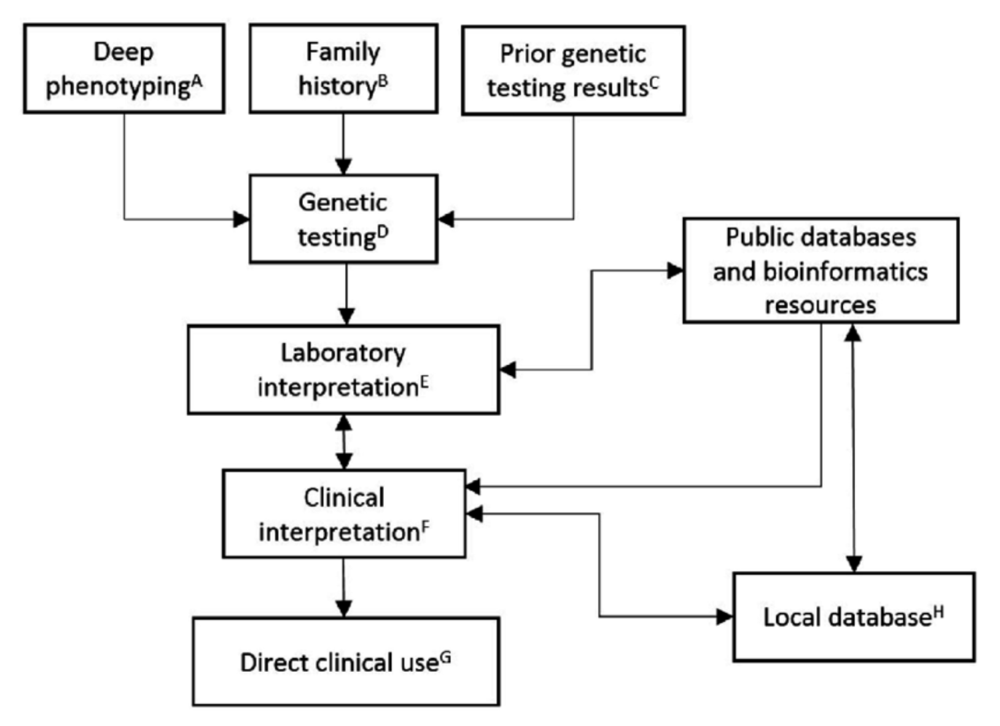
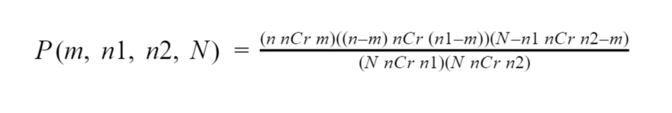
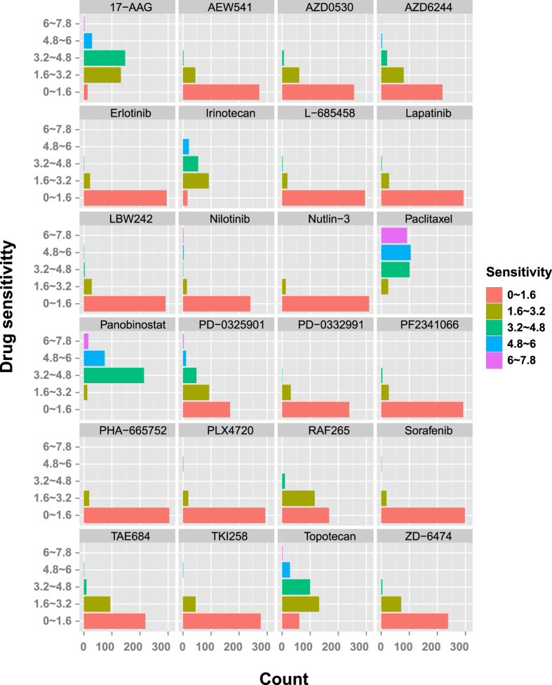
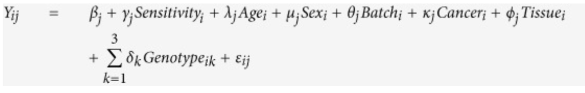
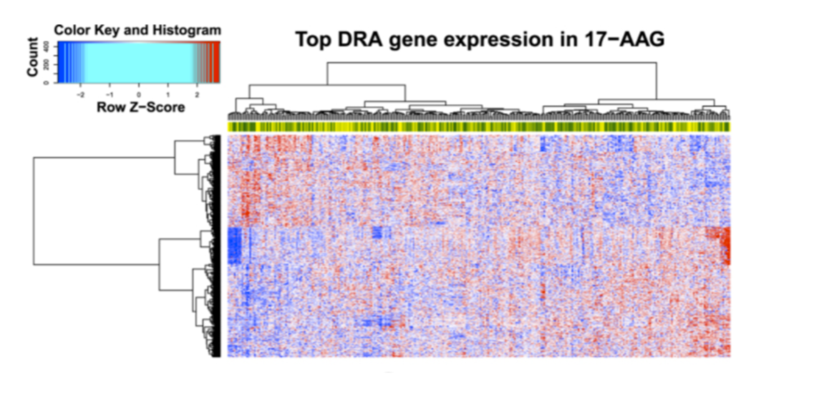

  
# Precision Medicine with an emphasize in  Pharmacogenomics 

### Overview:
#### 1. [Introduction to Precision Medicine](#1) 
#### 2. [A Brief History on Pharmacogenetics & Pharmacogenomics.](#2)
#### 3. [Personalizing drugs through pharmacogenomics.](#3) 
#### 4. [Applications of Bioinformatic tools:RNASeq](#4) 
#### 5. [References](#6)

### Part 1: Introduction to Precision Medicine

>According to NIH,Precision medicine is “an emerging approach for disease treatment and prevention that takes into account individual variability in genes, environment, and lifestyle for each person.”[1]  

  That is to say, precision medicine is a specific form of therapeutics tailored for each subpopulation of patients through the use of tools such as pharmacogenomics; an offspring of pharmacogenetics. Precision medicine aims to customize health care so that each treatment is tailored for every subpopulation in every possible way. Our main focus is pharmacogenomics with emphasis on genomic approaches. 
An overall layout of the procedure is seen below  
 

### Part 2: A Brief History on Pharmacogenetics & Pharmacogenomics

To be able to understand how pharmacogenomics came to be, we must first introduce Pharmacogenetics, a science that was recognized in the late 1950s which was dependent on “ the occurrence of unusual reactions to drugs on the basis of biochemical individuality.”[1]Revolving around studies that focus on “many different genetic changes of the enzyme that altered its functional characteristics”.[2] It later became clear that drug effects differentiate not only between populations, genders, and races but also between individuals. Drug metabolism also differs between individuals due to polymorphisms in drug-metabolizing enzymes leading to variability in the effectiveness of drugs [8]. For example, some metabolizers may absorb more of a specific drug than others across individuals, leading some of the drugs as well as some doses to be ineffective or inefficient to specific individuals. 

These findings were the building blocks of what we know today as Pharmacogenomics: the application of genomic technologies to drugs in clinical development. “ Pharmacogenomics exists a the intersection of pharmacology and genomics”[2], taking into consideration the “drug-metabolism phenotypes” of patients to better design drugs, drug combinations, and dosages for individual patients. Pharmacogenomic investigations require an increased use of methods designed to study many genes or gene patterns, that is to look simultaneously at the structure and expression of whole sets of genes. Such methods include high throughput sequencing technologies such as MALDI mass spectrometry, SAGE,  microarrays, RNA-Seq, linkage and haplotype analysis.

### Part 3: Drug production through pharmacogenomics 

#### Method 1: Making a drug network

Combining drugs allows them to accomplish what one alone cannot, enabling treatment of aggressive diseases such as cancer from multiple angles. These drugs tend to be more selective, with a limited scope, granting more precise action and lessened side effects. Incorporating selective medicines forms a medicinal team capable of launching several accurate defenses at multiple areas. However, careless combination can lead drugs to counter each other’s effects, a quality known as antagonism.
 
 A group led by Ke-Jia Xu pioneered the creation of a drug network [6]. The network and corresponding formula predicts synergistic drugs and thus saves time otherwise wasted on testing combinations by brute force. Drug network construction is an efficient method where drugs are represented as nodes and connected by edges with widths proportional to their ability to complement one another also known as therapeutic similarity. The following equation depicts how the drug network is constructed. 
 
 
* N is the number of drugs in the network 
* n1 & n2 are the partners of drugs 1 and 2 
* m is the number of chemicals they have in common with each other 

Drugs not connected by edges would create useless, if not harmful combinations 
The closer this value is to 0, the likelier the chance a useful combo has been found, which will form an edge between these drug nodes. 

 

Drug nodes that are particularly popular with other drugs are colored red, meaning they’ll be crucial to many effective drug combos which can alert manufacturers to prioritize the production of this  specific drug/ingredient.
  
Alternatively, since drug networks aren’t the first attempt to calculate effective combinations, it’s also possible to draw data from previous forays to simplify the process, like the Drug Combination Database. After expelling the combos lacking Anatomical Therapeutic Chemical (ATC), which saves computational time, they feed the ATC of various drugs into the following formula 

 

ATCk(d) denotes the ATC codes at the Kth level.  
This is then used to calculate Therapeutic similarity:

 

* d1 and d2 are the two drugs represented as nodes to be connected or not 
* n ranges from 1 to 5, representing all possible ATC levels.	 

Therapeutic similarity can be understood to be a measure of effectiveness of a drug pair.  
This value determines the width of the edge connecting the two nodes. No edge means no similarity. 
The two equations and the visual representation of the drug network, a time and labor efficient method of unearthing effective combinations is born. The combinations theorized by drug networks are tested rigorously through clinical trials to determine the validity of the combination.

To name a few that Xu favors, dermatologists confirmed the efficacy of their combination drug named Tri-Luma amongst Asian subjects burdened with Melasma, a pigmentary disorder involving increased melanin. The questionnaires distributed to those consuming the drug combo and the conventional treatment revealed those of the former had much higher satisfaction scores than those of the latter. Similar degrees of success were found in experiments surrounding people with various comorbidities that negate the curative properties of a lone drug, but find themselves outmatched when confronted with a fusion of them. For instance, diabetes may worsen high blood pressure normally present in those with hypertension, but Amiloride and Hydrochlorothiazide mixture helped them both. 

One drawback to the network is that, while they identify complementary combos, they lack info on the dosages or drug concentrations. Many conventional medicine advise patients to take an arbitrary amount catered to average individuals. But it defeats precision medicine’s purpose to generalize dosage, so longer trials, lengthened due to the need to gather results arising from different dosages and their effects on the subjects, are needed. With billions of existing drugs, an amount growing by the second, the optimized methods described here may still take a long amount of time. Certain diseases may need to be prioritized, meaning the treatment for others must endure delays. 
 
#### Method 2: Freshly-Made Compounded Medicine (Falconer) 

In some cases, patients lack the time needed for analysts to finish constructing their graphs and verifying their results via clinical trials therefore leading to different methodologies with varying difficulty to produce medicine on demand [7]. For instance, the simplest method is simply crushing the solid form of a medicine and mixing it into water. 

The liquid counterpart proves to be more amenable to those afflicted with dysphagia, a condition that impedes swallowing. Researchers may ascertain this condition’s presence by scanning for substitutions of Valine to Methionine due to polymorphism of rs2565 of the BDNF gene, a gene heavily involved the esophageal motor functions. Said polymorphism was discovered via transcranial magnetic stimulation which correlated with the SNPs locating the substitutions. However, some medicinal ingredients are insoluble, and attempts to mix them may create solid deposits that threaten to choke the drinker. Inactive excipients, components that accompany but have no effect on the drug’s active ingredients’ efficacy, can be incorporated to increase solubility.

There are downsides to this approach since the distribution of these remedies have less standards to adhere to than the preparation of drug themselves which call into question to their stability and safety. These remedies are vulnerable to degradation such as oxidation or hydrolysis which impairs the body’s ability to absorb the drugs or facilitates the synthesis of unexpected and potentially dangerous byproducts. Water content, which is prevalent in medicinal solutions, can devolve into breeding grounds for various microorganisms. Special attention must be paid, like controlling the pH or temperature, to maintain sterility. Since they’re brewed on demand, the combinations must be known beforehand, but since predictive methods like the drug network exist, it renders this limitation moot.

However these downsides don’t brand this method as irredeemably bad since most of its products, which range from ointments to suppositories, are advised and designed for consumption moments after production, denying time that may otherwise be spent to degrade or contaminate the medicine. 

### Part 4. Applications of Bioinformatic tools:RNASeq

#### Identifying genetic factors excluding people from conventional medicine

The presence of an abnormal gene can lead to a line of descendants exhibiting sensitivity towards drugs that are otherwise beneficial to those bearing the same illness[3]. The naive way, is to commission a control and treatment group so that sensitivity can be evaluated. However, it is not only a costly procedure but also unethical in cases where the illness necessitates drastic treatments like chemotherapy, which harms both healthy and ill individuals alike.

Instead, researchers utilized subjects who provided consent as well as a completed a survey to provide biographical information latter used to present phenotypic classification for the data. The subjects also provided saliva samples that were used to gather data about single nucleotide polymorphisms(SNPs). Through this, genome-wide association studies(GWAS) were able to analyze each class’s SNPs. The latter proves useful for GWAS that will analyze each class’s SNPs. The data from these GWAS can be subjected through association tests with logical regression that’ll produce a p-value determining significance. Small p values indicated that these patients are inheritors of unique markers or conditions that affect their ability to get regular medicine [4] . The presence of these unique markers inform medical providers to select a more precise treatment for patients. 

Another example of genome-wide studies revealing problematic SNPs is a study by the SEARCH study collaborative group, who discovered that the rs4363657 SNP brought muscular degeneration to those who consumed statins, a drug known to treat hypertension. The group extracted DNA from their subjects and stained them so they’d fluoresce, amplified them with gel electrophoresis, and elongated them with PCR. Using a BeadChip to collect SNPs, they initiated single-SNP analysis and outed the troublesome polymorphism [5].

#### Connecting RNA-Seq

As previously discussed in regards to the naive approach, testing for drug sensitivity experimentally can be both costly and invasive to patients. However, with the advancement of high throughput sequencing, it has become possible to assess phenotypic reactions to treatment at a lower cost while obtaining more information on a molecular level. This allows researchers to have a better understanding of how gene expression differs between subpopulations who have different sensitivity to a given drug. Thus, RNA-Seq equips researchers to evaluate the complexities of drug responses through transcriptome data of  populations. RNA-seq can better advance pharmacogenomics since it connects drug sensitivity to gene expression which is crucial to the development of  more effective therapies.

Drug sensitivity can be visualized as a histogram. Below, histograms are denoted  as sensitivity value for each 323 cell lines treated with 24 drugs. The sensitivity of the drug was measured by measuring the area under the dose-response curve (denoted as activity area). 
Each histogram denotes the distribution of sensitivity values of a drug treating on cancer cell lines. 
 

 An example of the application of RNA-Seq in better defining the transcriptome differences between populations with diverse phenotypic drug response is seen in a study that has combined drug sensitivity studies and the Cancer Cell Line Encyclopedia (CCLE) to investigate possible causes for adverse drug response across cancer cell types through analysis of differential expression of drug-response associated (DRA) genes. In recent years, studies have focused on the identification of DRA biomarkers due to their association with anti-cancer drug sensitivity and the success of clinical trials which used drugs specifically targeting these genes. The study used data from the CCLE since it provides a valuable resource of gene expression profiles of 20,069 genes for 504 human cancer cell lines. The gene expression levels allowed for the use of a method (defined below) to calculate the drug sensitivity across the genes in all 
samples. 

A linear regression model was used in order to inquire which genes are sensitive to each drug across all samples while taking into consideration confounding factors such as age, batch, cancer type, tissue and cancer cell line genotype. These factors were chosen because they are hypothesized to contribute to gene expression variation in response to drug treatment.

Through this, the sensitivity regression coefficient, γj was calculated across all samples and all genes   

 

* Yij is the expression level of gene j in sample i  
* Sensitivityi is the drug sensitivity of sample i 
* Agei denotes the age of sample i, 
* Sexi denotes the sex of sample i 
* Batchi denotes the batch information of sample i, 
* Canceri denotes the cancer type of sample i  
* Tissuei denotes the tissue type of sample i  
* Genotypeik denotes the k-th principle component value of the genotype profile for the i-th sample  
* εij is the error term  
* βj is the regression intercept  
* γj is the sensitivity regression coefficient (if γj > 0positively associated and negatively associated if γj < 0)  
* λj is the age regression coefficient 
* μj is the sex regression coefficient 
* θj is the batch regression coefficient 
* κj is the cancer type regression coefficient 
* ϕj is the tissue regression coefficient  
* δk is the regression coefficient for the k-th genotype PC. 
* Sexi, Batchi, Canceri, Tissuei are factor variables. 

From the outputted sensitivity coefficients, a permutation test was run 1,000 times to determine if each gene was found significantly sensitive to each drug. A gene was considered significantly sensitive to a drug if the value of its sensitivity coefficient was determined greater than or less than 0 by the permutation test. Further, Benjamini Hochberg method was used to adjust the p-values with a False Discovery Rate (FDR) of less than 0.1. Drugs with 20 or less DRAs identified were not included in the rest of the study leaving 14 drugs after this analysis.

The genes identified as sensitive to a given drug were then separated into genes that were positively regulated (upregulated) in response to the drug, or negatively regulated (downregulated). These expression patterns of the significantly sensitive DRA genes for the drug 17-AAG are visualized using a heatmap of the z-scores of the gene expression across all samples (columns) and genes (rows).

 

As seen above, hierarchical clustering was performed with a Euclidean distance metric on both samples and genes. The clustering reveals that there are 2 main groups of genes based on their expression values: genes with relatively low sensitivity to the drug deemed “non-sensitive group” and genes with relatively high sensitivity to the drug deemed “sensitive group”. The clustering of “non-sensitive” and “sensitive” groups was seen across all 14 drugs. A student t-test was run between these groups across all drugs and all p-values were found to be less than 2.0 × 10^−7.

Hence, the study demonstrates a correlation between the gene expression of DRA genes and drug sensitivity allowing a different approach to construct drugs that better pinpoints drug targets through analysis of  transcriptome data. Further, the study continues by analyzing the same expression profiles per groups believed to influence drug response such as gender and age supplying researchers the ability to distinguish which genes are more sensitive to specific drugs  for a given subpopulation. It has provided a more calculated advance in drug production by taking into account the genomic aspect of the population. Moving forward, precision medicine is becoming a reality since drugs can be developed for specific subpopulations given their molecular drug response. 

### Part 5: References 

[1]Kalow, W. Pharmacogenetics and pharmacogenomics: origin, status, and the hope for personalized medicine. Pharmacogenomics J 6, 162–165 (2006) doi:10.1038/sj.tpj.6500361

[2]Innocenti, Federico. Pharmacogenomics Methods and Protocols. Human, 2016

[3]Liu, X. et al. A systematic study on drug-response associated genes using baseline gene expressions of the Cancer Cell Line Encyclopedia. Sci. Rep. 6, 22811; doi: 10.1038/srep22811 (2016).

[4]Qs Li, C Tian., et al. “Analysis of 23andMe antidepressant efficacy survey data: implication of circadian rhythm and neuroplasticity in bupropion response.” Translational Psychiatry, 2016, doi:10.1038/tp.2016.171

[5]SEARCH Collaborative group. “SLCO1B1 Variants and Statin-Induced Myopathy — A Genomewide Study.” The New England Journal of Medicine, 2008, doi:10.1056/ NEJMoa0801936. [PubMed: 18650507]

[6]Xu et al.: The drug cocktail network. BMC Systems Biology 2012 6(Suppl 1):S5.

[7]James R Falconer, Kathryn J Steadman. “Extemporaneously compounded medicines”. Australian Prescriber, 2017. doi:10.18773/austprescr.2017.001

[8] C. Kupiec, Thomas.  Raj, Vishnu. Vu, Nicole. Basics of Pharmacogenomics for the Compounding Pharmacist.  International Journal of Pharmaceutical Compounding, Vol. 9 No. 4 July/August 2005 

