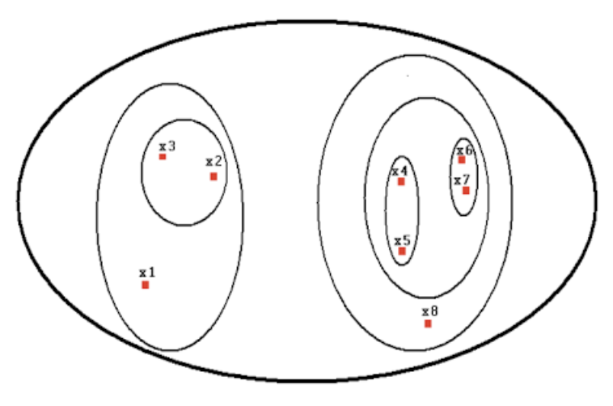
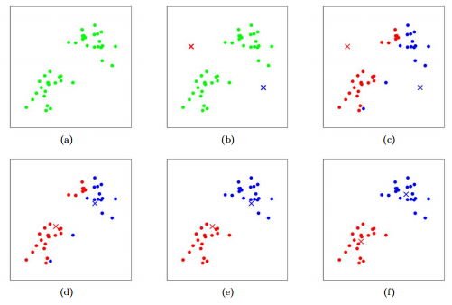
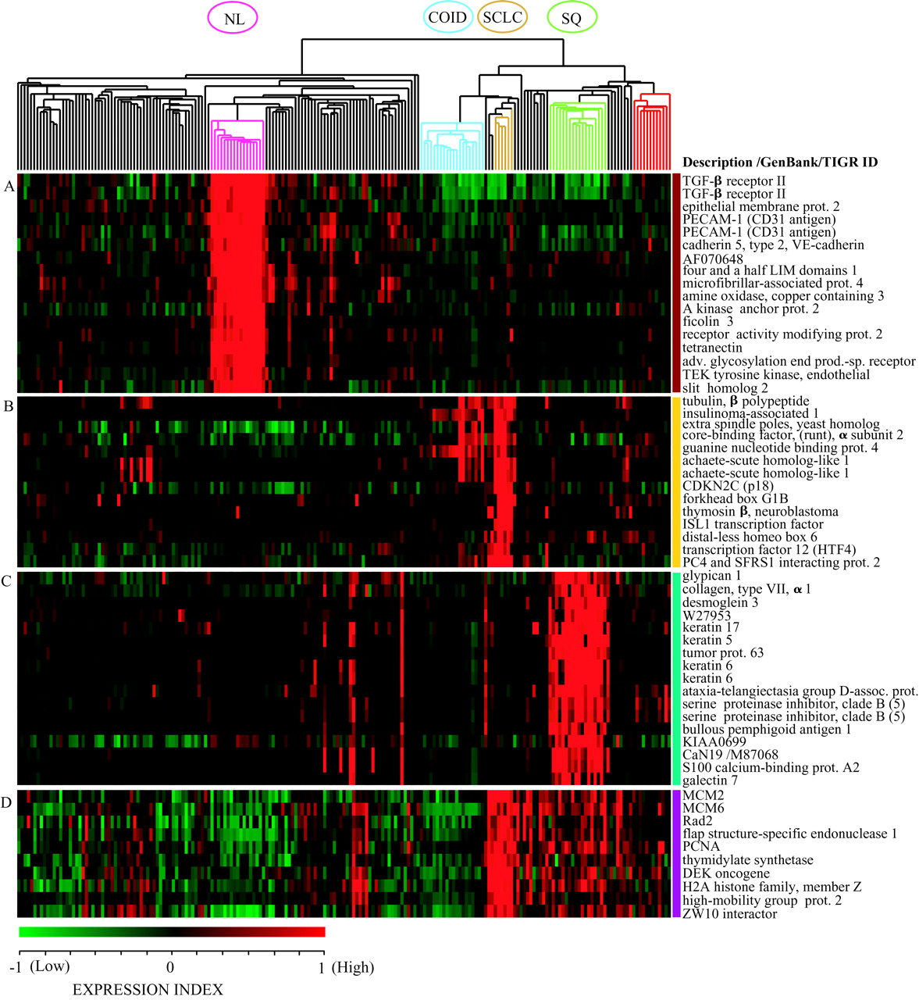
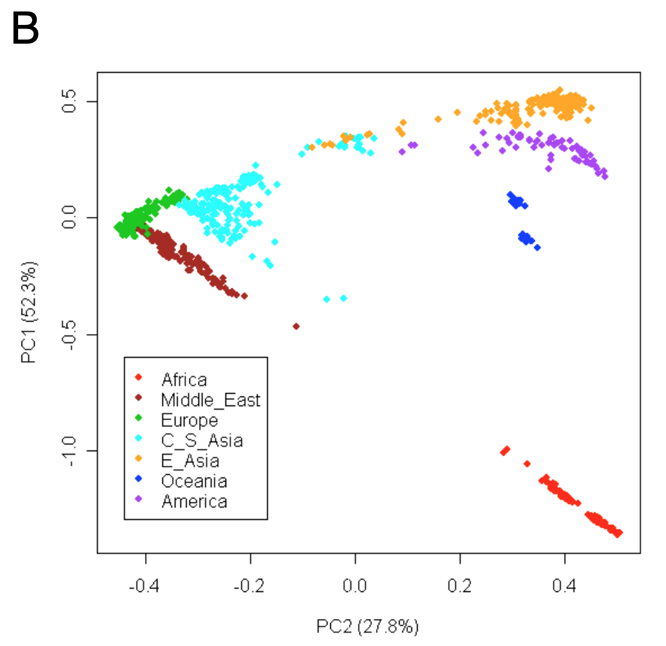
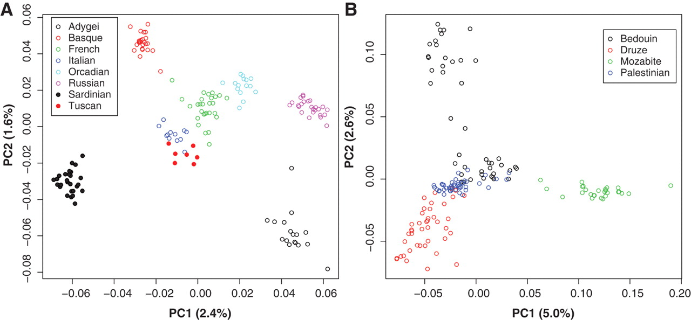
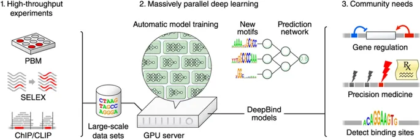
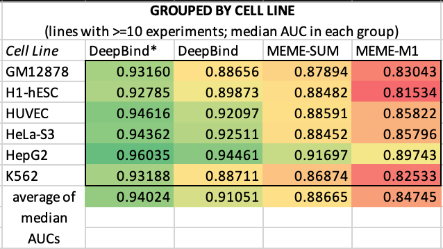
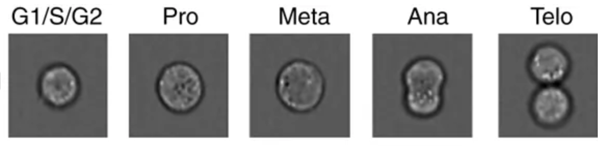
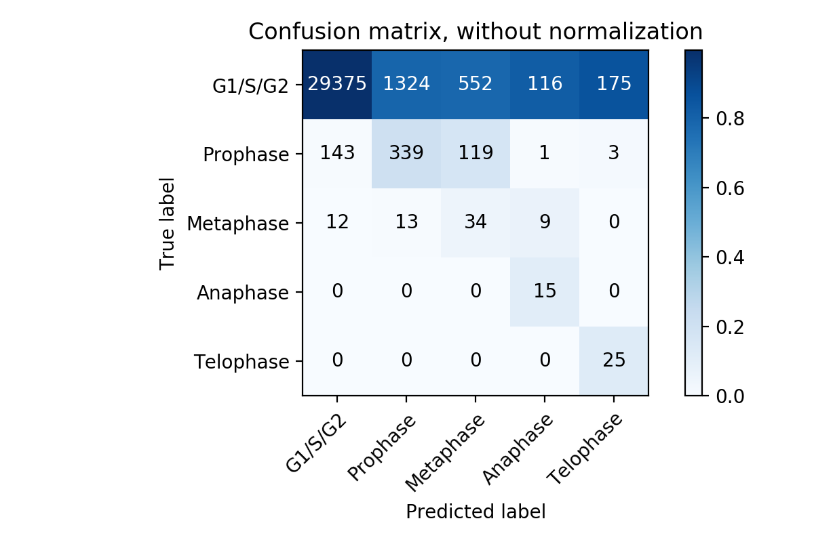
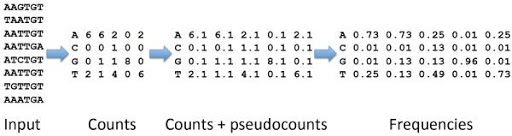

# Machine Learning in Bioinformatics 

Justin Huynh 

Kevin Ramos 

Aaron Ho

University of California, San Diego

---

## Introduction

Machine learning has become an important topic of discussion in research because it can be used to analyze large datasets and discover specific patterns that are not immediately visible to the human eye. The field of Bioinformatics has increasingly begun to use machine learning methods to gain greater insight and make predictions about complex biological processes in organisms. Specifically, machine learning methods are being used in genomics to analyze DNA sequences in various ways including finding subclasses of diseases, determining ancestry of individuals, predicting transcription factor binding sites, and predicting cell cycle phases. In discussing machine learning methods, it is important to distinguish two different types of learning: *supervised and unsupervised learning*.

In **supervised learning**, the model is trained using a labeled dataset. In other words, the correct labels are known and act as a “teacher” that corrects the algorithm during its training. The algorithm iteratively makes predictions on the training dataset until it reaches an acceptable level of performance. Supervised learning problems can fall under classification, in which the algorithm's output value is a category.

In **unsupervised learning**, the input data does not have corresponding labels. The goal of this type of learning is to model the distribution of the dataset in order to gain greater insight about the data. Unsupervised learning problems can fall under clustering, which is useful for uncovering groups within the data. 

## Clustering

Clustering is a useful technique that groups similar data points in such a way that similar points will be grouped closer to one another, thus forming a cluster. The two clustering techniques that we will discuss are hierarchical clustering and K-means clustering. 

---

### Hierarchical Clustering 

In Hierarchical clustering, similarity (distance) between points is calculated to cluster the most similar points together. This process is repeated until only a single cluster is left. Essentially, the algorithm builds a hierarchy of clusters.  
The algorithm for Hierarchical Clustering is as follows:

1. Calculate the similarity (distance) between all possible combinations of two profiles.
2. Place each profile in a separate cluster.
3. Group the two most similar clusters into a new cluster.
4. Calculate the similarity (distance) between the new cluster and all remaining clusters.
5. Repeat steps 3 and 4 until all profiles are in one large cluster.

### K-means Clustering

In K-means clustering, we choose an arbitrary “K” value which represents the number of clusters. Then, K points are selected to serve as a mean for each of the K clusters. The algorithm iteratively reassigns points to new clusters with the goal of minimizing the point’s distance to the cluster’s mean. 

The algorithm for K-means clustering is as follows:
1. Select a value K which represents the number of clusters.
2. Select centroid points for the K clusters.
3. Assign all points to their closest cluster centroid.
4. Calculate the new centroids for the newly formed clusters using.
5. Repeat steps 3 and 4.

The K-means algorithm terminates under the following conditions:
1. The centroid of newly formed clusters does not change.
2. The points do not change clusters.
3. The maximum number of iterations has been achieved.

With K-means clustering, the results can vary based on the “K” value that is chosen as well as the initial points for the clusters. In contrast, Hierarchical clustering can produce more intuitive results because it simply relies on calculating similarity (distances) between points and does not require choosing an arbitrary “K”. [1]

## Applications of Machine Learning to Biological Big Data and Bioinformatics

### Finding Subclasses of Lung Cancer via Clustering of Gene Expression Profile

https://www.pnas.org/content/98/24/13790.long

Given a cohort of individuals with lung cancer, different subclasses of lung cancer can be identified among the samples using hierarchical clustering of their gene expression profiles. The first step is to use some method, such as RNA-seq, to quantify the gene expression level for each individual. After generating the gene expression profiles for each individual, differential expression analysis can be performed on each sample, and the most differentially expressed genes can be used in downstream analysis. Namely, hierarchical clustering can be performed on the most differentially expressed genes, which allows for identification of clusters of samples, where each cluster represents a subtype of lung cancer.  [2]

<b>Results:</b>

Figure: In this study, oligonucleotide microarrays were used to find mRNA expression levels corresponding to 12,600 transcript sequences in 186 lung tumor samples, including 139 adenocarcinomas resected from the lung. Hierarchical clustering performed on 203 samples identified several subclasses. 

### Determining Ancestry of New Samples via Clustering (Principal Component Analysis) of Genome

https://science.sciencemag.org/content/319/5866/1100.full	

Given a cohort of individuals hailing from various ancestries, clustering can be used to determine the ancestry of each person based on their genetic profile. The first step is to sequence each person’s genome. Then, locations of allelic single nucleotide polymorphisms (SNPs) were determined by comparing each sample genome to the orthologous chimpanzee reference. An Identity-by-State (IBS) matrix is calculated using the SNPs of each sample, to quantify the pairwise distance of each sample from every other sample. For example, given 938 samples, a 938 by 938 IBS matrix is calculated, where each sample is represented by a single row or column in the matrix, and each row/column represents the pairwise distance of a sample from every other sample. Finally, principal component analysis(PCA), a type of dimensionality reduction/clustering that relies on finding the top eigenvectors that capture the most variance in a data set, is performed on the IBS matrix. Each row or column of the IBS matrix represents a single data point. Visualization of principal components(PCs) 1 and 2 show distinct clustering of samples according to ancestry. For this experiment, a cohort of 938 fully consenting individuals from 51 subpopulations from sub-Saharan Africa, North Africa, Europe, the Middle East, South/Central Asia, East Asia, Oceania, and the Americas was used, and over 650,000 autosomal SNPs were analyzed. [3] 

<b>Results:</b>

Figure: PCA performed on 938 dimensional IBS matrix, each row representing a sample. The first and second PCs explain 52% and 27% of the IBS variation, respectively. 51 populations were separated into known continental groups. PC 1 appears to capture the contrast between sub-Saharan Africans and non-Africans and the PC2 captures the East-West difference in Eurasia.

Figure: Performing identical technique (pairwise IBS matrix, PCA) on individual subgroups reveals further clustering of the data into known subpopulations. 

### Transcription Binding Site Prediction using Convolutional Neural Network on Binding Motifs

https://www.nature.com/articles/nbt.3300

After performing CHIP seq, a popular downstream analysis to perform on the sequencing data is to formulate a position weight matrix (PWM). The PWM is a 4 row by n column, where n is the length of the motif, that quantifies, for distinct sequences in the genome i.e. motifs, the probability that the motif is a binding sequence for the proteins in the CHIP seq experiment. The PWMs are then used to identify protein binding motifs: the motifs with the highest scores are likely to be bound by proteins. Those motifs are identified in the genome as protein binding sites. [4]

PWMs are formulated in a relatively straightforward way, using the read counts along with a scoring function, to generate a probability or score for each motif.  However, more complicated techniques have been proposed as an alternative, and have achieved state of the art performance in motif finding. DeepBind[4] uses a deep convolutional neural network (CNN) to scan CHIP-seq reads and output motifs, and has outperformed traditional methods as well as other machine learning methods. 

Figure: Pipeline of DeepBind. We see that the input are reads from any one of various protein binding sequencing techniques, and the output is motifs. The motifs can then be used for many downstream tasks, including detecting binding sites. Our explanation focuses on analyzing CHiP seq data to find transcription factor binding sites, because it is related to what we have covered it in class.  

<b>Results:</b>

CHIP-seq data from 506 experiments from the ENCODE database were used to train the experimental deep learning based DeepBind model.  Performance metric to quantify motif finding accuracy was AUC (area under curve), calculated by comparing the predicted motifs to true motifs. Performance of DeepBind was compared to MEME, a PWM based baseline model.  The AUC was calculated for each of 506 experiments, and the median AUC for each of 151 unique transcription factors is shown on the left, and for 6 cell lines shown on the right. Overall, the DeepBind model outperforms MEME for motif finding by 6-7%. 

Figure: AUC of DeepBind model vs MEME baseline model on prediction of transcription factor binding sites from 506 CHIP seq experiments. Top: Median AUC grouped by transcription factor. The best performing DeepBind model achieved 0.928 average median AUC, and the best performing MEME model achieved 0.85 AUC. Bottom: Median AUC grouped by cell line. The best performing DeepBind model achieved 0.94 average median AUC, and the best performing MEME model achieved 0.886 AUC. The average AUC of the best performing DeepBind model outperforms the best performing MEME model for motif finding by 6-7%. 

### Cell Cycle Phase Prediction using Convolutional Neural Network on Images of Jurkat Cells

https://www.nature.com/articles/s41467-017-00623-3

There is much value in developing an automated, non-invasive technique to detect the cell cycle of cells. Current prevalent techniques are invasive, and often rely on injecting some type of radioactive markers or dyes into the cell. An automated method to detect cell cycle given the image of the cell can potentially provide a safer, more efficient, and non-invasive alternative. Convolutional neural networks(CNN), a type of deep learning model that excels in image analysis, can be used for both prediction and clustering tasks. In this study, a convolutional neural network was used to predict the cell cycle phase of jurkat cell images. After training the model on 33,000 images, predictions were made on 3000 images. An accuracy of 98% was achieved, a 6% improvement over traditional machine learning techniques. [5]

Figure: Images of jurkat cells in each stage of the cell cycle.

<b>Results:</b>

Figure: Prediction results of trained convolutional neural network on 30,000 images. 98% accuracy is achieved, a 6% improvement over the baseline model, which used a traditional machine learning model (not a deep neural network). 

## Challenges of Machine Learning Approaches in Bioinformatics

### Consequences of Overfitting Given Insufficient Data

https://www.nature.com/articles/s41588-018-0328-0

Machine learning is a powerful tool that can analyze the large datasets becoming commonplace in bioinformatics. However, there are many hurdles that come with the application of machine learning in genomic discovery and prediction. One such hurdle is machine learning algorithms require both high quality and quantities of data that may not always be readily available. 

In the field of functional genomics, the large amounts of genomic data allow for accurate prediction models to be created. However, despite the growing accuracy in these predictive models, there are still ‘hidden’ factors that can have profound effects on the genome that can’t be accurately predicted for. [6] Whether it’s non-coding regions or discoveries in alternative splicing, these ‘hidden factors can lead to false positives and “overfitting” of data. As such, although a powerful tool, it’s important to understand the limitations of machine learning and predictive models of discovery, when the current datasets are insufficient. 

### The Black Box of The Predictive Model

https://www.ncbi.nlm.nih.gov/pmc/articles/PMC6469083/#Sec4title

https://www.ncbi.nlm.nih.gov/pmc/articles/PMC5938574/

Machine learning has given us the ability to create relational models and process information from increasingly complex datasets that are impossible to analyze with traditional techniques. As a byproduct, the techniques used to interpret and process these datasets have also become increasingly complex. Consequently, many scientists choose to forgo an understanding of the models approach or it’s predictive accuracy, instead just focusing on it’s input and output. In machine learning this is known as ‘The Black Box’ of the model.

This issue is especially pronounced and problematic in the bioinformatics. Due to the interdisciplinary nature of bioinformatics, there are many scientists with a strong background in genomics that have no knowledge of machine learning methods, as such there are large amounts of scientists with no understanding of the selective methods of the model. Similarly, there are many data scientists creating models using methods that are meant for interpreting data in more quantitative fields like banking, but lack the biological knowledge to create accurate predictive models in genomics. This lack of understanding of  “The Black Box” both computationally and scientifically can lead to issues with data interpretation. [7] 

An example of this is seen in bioinformatics in a medical application. A model was trained and assigned patients with asthma a higher rate of survival to pneumonia. [8] In this sense the data was very much correct in that the asthma patients survived pneumonia more than non-asthma patients. However, the model did not take into account the real reason for survivability, which was that  asthma patients have higher priority in hospitals, and are seen more often. This is an example of how the black box problem of focusing on strictly input and output can cause huge problems in bioinformatics, and possibly dire consequences in the fields of science and medicine.

As previously stated, there are many ‘hidden’ factors in biology, and without understanding the process of the predictive model, we may not be able to model data accurately, or interpret data correctly. In a field where a large number of scientists rely solely on the results of data input and output, a lack of understanding how that data is analyzed can be especially dangerous, especially when the model isn’t fully optimized.

Figure: Interpretation of a predictive model. Data input through ‘The Black Box’ leads to processed data meant for interpretation.

### Reliance on Prior Knowledge, and Misapplication of Machine Learning

https://www.ncbi.nlm.nih.gov/pmc/articles/PMC5204302/

As a relatively new and powerful field in science, machine learning is often times thrown at complex problems. However, there are many issues that are either unknown or random in nature that create limitations in machine learning models. One of the biggest weaknesses of machine learning methods, is it’s reliance on prior knowledge.

This reliance on prior knowledge creates issues where a big part of using machine learning models requires us to frame the question in a way that uses previous data. [9] Since predictive models are meant to give predictions, when dealing with random or unknown data types, the model will force a categorization or label based on previous knowledge, when in fact two datasets don’t overlap. In areas that require sensitive clustering like precision medicine, misapplying the incorrect algorithm can lead to false positives and inhibit discovery of new diseases or medicine. That’s not to say that using previous knowledge is inherently bad, but instead the reliance on previous data in clustering and predictive modeling can lead to misapplication of Machine Learning in Bioinformatics where traditional methods would be much more effective.

Figure: Prior knowledge of  nucleotide count being used in order to create a usable dataset, and predict frequencies using pseudocounts

## Future of Machine Learning in Bioinformatics

Future applications of machine learning techniques in the field of Bioinformatics have the potential to contribute to the areas of patient-specific pharmaceutical drugs, newborn genetic screening tools, and agriculture. Pharmacogenomics is studying how the genetic make-up of an individual plays a role in their response to drugs. Newborn genetic screening tools are being developed to collect data at birth and screen for certain diseases. Lastly, genetic data is being used to predict the yield and health of crops, which could help farmers better optimize their yields. Machine learning is currently impacting multiple areas of Bioinformatics research and it will continue to be an active field in the near future. [10]

## References

[1] Kimes, P. K., Liu, Y., Neil Hayes, D., & Marron, J. S. (2017). Statistical significance for hierarchical clustering. Biometrics, 73(3), 811–821. doi:10.1111/biom.12647

[2] Bhattacharjee, Arindam, et al. "Classification of human lung carcinomas by mRNA expression profiling reveals distinct adenocarcinoma subclasses." Proceedings of the National Academy of Sciences 98.24 (2001): 13790-13795.

[3] Li, Jun Z., et al. "Worldwide human relationships inferred from genome-wide patterns of variation." science 319.5866 (2008): 1100-1104.

[4] Alipanahi, Babak, et al. "Predicting the sequence specificities of DNA-and RNA-binding proteins by deep learning." Nature biotechnology 33.8 (2015): 831.

[5] Eulenberg, Philipp, et al. "Reconstructing cell cycle and disease progression using deep learning." Nature communications 8.1 (2017): 463.

[6] Deep learning for genomics. Nat Genet 51, 1 (2019) doi:10.1038/s41588-018-0328-0

[7] Xu, C., & Jackson, S. A. (2019). Machine learning and complex biological data. Genome biology, 20(1), 76. doi:10.1186/s13059-019-1689-0

[8] Libbrecht, M. W., & Noble, W. S. (2015). Machine learning applications in genetics and genomics. Nature reviews. Genetics, 16(6), 321–332. doi:10.1038/nrg3920

[9 ]Libbrecht, M. W., & Noble, W. S. (2015). Machine learning applications in genetics and genomics. Nature reviews. Genetics, 16(6), 321–332. doi:10.1038/nrg3920

[10] Sennaar, K. (2019). Machine Learning in Genomics – Current Efforts and Future Applications | Emerj. Retrieved 9 December 2019
