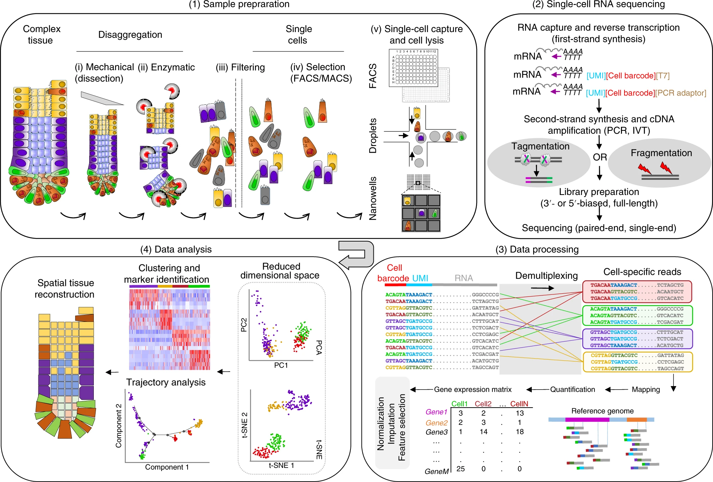
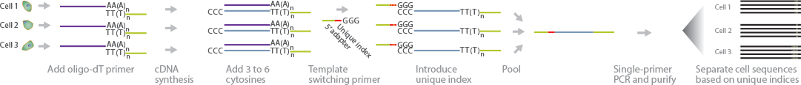
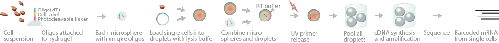
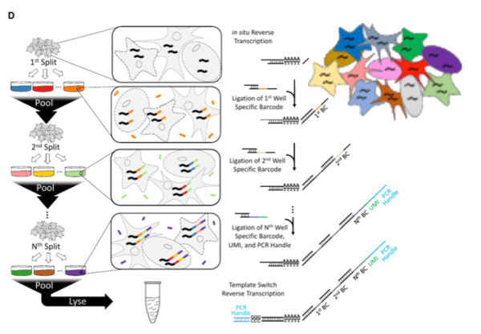
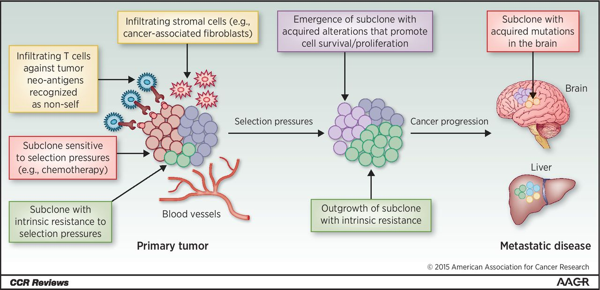
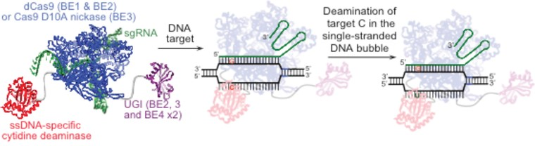
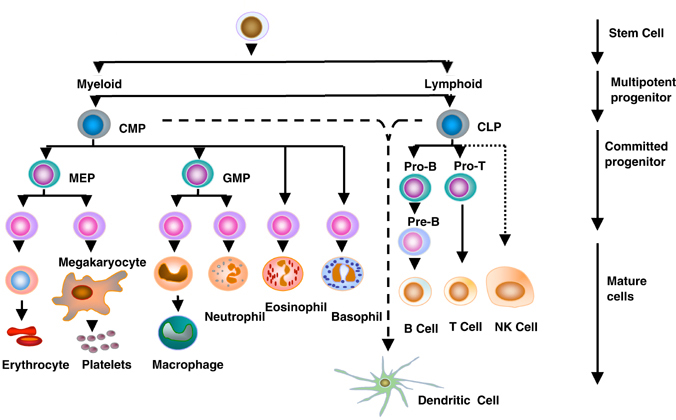

# BENG183-Final-Project
Group 12, Michael Lamkin, Chase Deveraux, Chinmay Joshi

## Outline
1. [Intro to scRNA Sequencing](#1) 
2. [General Protocol](#2) 
3. [History](#3) 
  a. [STRT-seq](#7) 
  b. [CEL-seq](#8) 
  c. [SPLiT-seq](#9) 
4. [scRNA-Seq Uses](#4) 
5. [scRNA-Seq vs Alternate approaches](#5) 
6. [References](#6) 

---
## Intro to scRNA-seq 
ScRNA-seq aims to give a higher resolution image of the differences between individual cells, both within and between tissues. The fundamental goal that underlies scRNA-seq is to capture cell-specific sequence information that can be used to determine a cell's state or function.
This process has seen many refinements in recent history, and new applications are being discovered at a rapid pace. We'll first examine how scRNA-seq has developed over time, and then analyze just a few of the many use-cases for it.

---
## General Protocol 

To capture such information, scRNA-seq must accomplish the following:
1. Sort cells based on phenotype
2. Isolate single cells from each sorted group
3. Lyse cell and purify total RNA sample
4. Reverse-transcribe cDNA from RNA
5. Sequence cDNA

Once sequenced, a raw count gene expression matrix is created where we can then perform all of our analyses to discover or solve what we originally set out to. However, in order for our results to be meaningful we must normalize the counts based on gene length and read library size. Below is an example of a normalized gene expression matrix where the rows are the specific genes and the columns are the specific cells. 

---
## History 
Very early scRNA-seq technologies were developed and utilized from 2009 to 2011. These technologies laid the foundation for later innovations, and generally followed the following practices:
1. Sort and isolate cells using preferred method (FACS being the most popular)
2. Lyse cells and collect total mRNA sample using standard RNA purification
3. Using a poly-T primer which base pairs with the poly-A tail of mRNA's, generate cDNA with a reverse transcriptase.
4. Sequence generated cDNA via a PCR-based sequencing method

## STRT-seq 

Developed in early 2011, Single-Cell Tagged Reverse Transcription Sequencing (STRT-seq) is one of the first examples of a comprehensive scRNA-seq technology. The main goal of the procedure is to achieve scRNA-seq in parallel, allowing for the processing of many cells at once. To accomplish this, standard practices are followed until the generation of cDNA. A specific reverse transcriptase is used which appends the 3' end of each 1st-strand cDNA with 3 to 6 cytosines. The poly-N tail addition of various reverse transcriptases was a known pehnomenon, but STRT-seq sought to use it in an innovative way.

In STRT-seq, a template-switching oligo (TSO) is base-paired to the poly-C tail of the cDNA before synthesis finishes. The oligo is comprised of a 3' poly-G tail, along with a unique "barcode" sequence in the middle and a universal adapter at its 5' end.
The reverse transcriptase will then switch templates to the TSO (hence the name), and continue cDNA replication. 2nd-strand synthesis then occurs, and the result is double-stranded cDNA (dscDNA) which contains not only the relevant RNA information, but a unique barcode which can identify it. These fragments can then be pooled, amplified via PCR, and sequenced en-masse. Each cell's generated sequences can be uniquely identified by its barcode. This allows for the parallel processing of many single cells at once, greatly increasing the throughput of scRNA-seq. 

Most of the limitations of this early technology were related to its reliance on PCR for fragment amplification. PCR has many biases which reduce the reliability of sequencing experiments. These biases include preference for small fragments and underrepresentation of GC-rich sequences. Later technologies would seek to improve on the PCR technology used, or avoid it altogether.

## CEL-seq 

Developed in late 2012, Cell Expression by Linear Amplification Sequencing (CEL-seq) was one of the earliest established methods that sought to improve the accuracy of earlier technologies. It did this by side-stepping the need for PCR-based amplification, opting instead to use a linear in-vitro amplification to achieve the requisite cDNA mass for sequencing.

CEL-seq operates with the same general theory of previous technologies, with a few notable differences. Individual cells are lysed within a microsphere (or "droplet"). This droplet also contains a uniquely barcoded oligo, along with other oligos to be used during reverse transcription. Like STRT-seq, fragments would be initially synthesized with a unique barcode and universal adapter. Another major difference is that, in addition to the barcode and adapter, a T7 promoter is also included when cloning the TSO. This is to allow the later transcription of the cDNA to occur - the T7 promoter aids the RNA polymerase complex in beginning transcription.

Once the dscDNA is generated, samples are pooled and proceed through the in-vitro transcription (IVT) reaction. The science behind this reaction is not directly relevant to the course material, but interested readers can learn more [here](https://www.ncbi.nlm.nih.gov/pubmed/21125481). This process results in RNA transcribed from the cDNA with very few biases for size or base content, a major improvement over STRT-seq. cDNA is then synthesized from the linearly-amplified RNA. This cDNA will be more representative of the actual state of the cell, since IVT linear amplification has no base-content or size biases. 

While CEL-seq made major advancements in the fidelity of high-throughput scRNA-seq, there were still some issues which prevented it's continued use. The method has a strong 3' bias, which can be detrimental to certain types of experiments. The IVT reaction also has a bias for abundant transcripts, meaning rare transcripts may be lost. Finally, the method is expensive, both in terms of the required sample RNA (> 400 pg) and in terms of time. The IVT reaction runs for 13 hours; pooling samples helps the throughput, but this runtime was still a limiting factor.

## SPLiT-seq 

  

More recent technologies have sought to reduce the cost of performing scRNA-seq experiments. The necessity of specific hardware to accomplish cell sorting is prohibitive to many labs, and makes individual research efforts unfeasible. Developed in late 2018, split-pool ligation-based transcriptome sequencing (SPLiT-seq) sought to reduce the cost of scRNA-seq while maintaining the accuracy and fidelity of earlier models.

Cell sorting is a prohibitive step of scRNA-seq, with the most reliable methods utilizing proprietary hardware. Sorting nonetheless seems necessary, as each cell must be barcoded in order for a pooling approach to work. Methods which do not pool cells before sequencing exist, but are limited by their inability to process many cells in parallel. Modern-day applications often require hundreds or thousands of cells, so non-pooling approaches are not commonly used. SPLiT-seq instead seeks to apply unique barcodes directly to pooled cells, negating the need for sorting.

The fundamental idea behind SPLiT-seq is to create barcodes combinatorily in a stepwise process. After these barcodes are generated, cDNA purification and sequencing can proceede as normal. To generate these barcodes, pooled cells are initially split into an arbitrary number of sub-pools (the original study did 96). Each sub-pool then undergoes an in-cell reverse transcription reaction, generating cDNA within the cells before lysing. This cDNA is then further synthesized using a TSO to append a barcode sequence. Of course, each cell in the sub-pool shares a barcode sequence, so they are not yet unique. The cells are then pooled, and re-split into a new set of sub-pools. The cDNA then undergoes two rounds of ligation, each round appending another barcode sequence. The final pooling and splitting preapares samples for PCR amplification by lysing the cells. This PCR amplification will append one more barcode sequence onto the generated cDNA, for a total of four. Thus, there are 96^4 possible barcode combinations. The experiment depends on the volume of cells being significantly smaller than the number of possible barcodes, so larger volumes of cells may need to be split into more sub-pools or go through more ronuds of ligation.

SPLiT-Seq is still a young technology, and has many areas in which it could improve. Depending on combinatorics to provide a unique barcode tends to give a higher doublet rate than other platforms. The method also uses PCR amplification, which introduces certain biases that could otherwise be avoided (as mentioned previously in this chapter). Still, the relatively low cost of the technology is certainly appealing, and it seems likely that it will be developed further in the coming years.

## Uses 
  
1. Tumors are clumps of cells that form due to mutations that alter cell proliferation rates and inhibit apoptosis. Due to this increase in proliferation and damage to the cell replication pathways, the progeny of these cells have an increase in mutation rate. The progeny may then build further resistances and form its own phylogeny. Since these mutations always occur in random positions, no two patients and no two tumors will have identical tumor genome compositions. Thus, it is crucial to study each patient’s tumor(s) and their respective phylogeny. Because of such, scRNA-seq is an invaluable tool that can be utilized to differentiate between these different cell populations. It allows a direct comparison through clustering gene expression data and can be effectively utilized for identifying novel expression regulation and mutations within coding regions.
  
  
2. Base editing is a biological tool which allows the user to make point mutations within a given sequence region of choice to study their effects on gene expression as well as protein structure and functionality. scRNA-seq is a valuable validation and measuring tool to discern the individual expression and base changes that each cell has undergone. For validation, scRNA-seq is used to identify which bases were mutated and how this gets displayed in the mRNA. While for measuring output, it is used to identify any alterations in expression by comparing normalized read count output to a control with no edits.  

  
3. Immunology has three primary cell types: lymphocytes, neutrophils, and macrophages. Of these three, lymphocytes are a main focus for studying unique cell characteristics due to their impact on our adaptive immune system since they include natrual killer cells, T-cells, and B-cells. However, studying cells involved within the immune system has had two primary challenges.
  * Visualizing single cell expression data that excludes noise
  * Inferring expression data to understand cell specificity and function for the purpose of aiding therapeutics   
  
scRNA-seq is an invaluable tool that allows unbiased characterization of these immune cells. In particular, scRNA-seq:
  * Identified novel subpopulations
      * Uncovered development states in myelopoiesis 
  * Elaborated cell differentiation pathways
      * Inferred the underlying regulatory genes from development states in myelopoiesis
  * Revealed unique cellular functions
      * Up-regulation of steroid synthesis pathway in Th2 cells following helminth infection

## scRNA-seq vs Alternate Approaches 

1. Tumor heterogeneity - An alternate approach to attempt to discern the composition of a tumor would be to grab cells from said tumor and run Bulk RNA-Seq or hybridization microarrays. However, these techniques fail to capture the phylogeny of these tumors since the sequencing is done in bulk, rendering it unable to differentiate between different cell types and expression levels. Thus, scRNA-Seq is a more efficient and targeted approach to determining tumor heterogeneity. 

2. Base editing - DNA sequencing is an alternative method that can be used to identify whether cells have received individual base edits. This is done by collecting DNA from each individual cell, sequencing them, and aligning the sequences. Since we've targeted a specific locus, we can focus on the reads mapped there and check for mismatches during alignment. Assuming the mismatch had a high enough base quality score, we can identify it as a proper edit and understand all edits that were made. However, this process will not allow us to generate the individualized RNA-seq profile that we are studying for each cell, and thus are unable to identify whether the base edit was associated with changes to alternate splicing or gene expression. No other method of gene expression analysis would allow us to understand the impact of each base edit and as a result scRNA-seq holds to be the strongest tool for this problem.

3. Immunology - Cytometry by Time of Flight(CyTOF) is an alternative method that can identify the presence of subpopulations, alternate cell differentiation pathways, and unique cellular functions through isolation of chromosomes. It does this through labeling antibodies with ion tags, targeting specific proteins, and using time-of-flight mass spectrometry to distinguish the proteins chosen. However, one issue with this method is using all antibodies in a given cell would result in too much noise to distinguish what pathways, subpopulations, and functions were affected. Thus, the antibodies have to be determined a priori which results in a bias of data. scRNA-seq can accomplish the same goal while avoiding the bias and any uneeded pre-scanning for specific proteins. Although, scRNA-seq is unable to identify if there are any influences post transcription on protein structure. Thus, while scRNA-seq may use less resources and avoids bias, it outputs less information and requires an extra step to analyze potentially altered protein sequence and structure.

## References 
Islam, S., Kjällquist, U., Moliner, A., Zajac, P., Fan, J. B., Lönnerberg, P., & Linnarsson, S. (2011). Characterization of the single-cell transcriptional landscape by highly multiplex RNA-seq. Genome research, 21(7), 1160–1167. doi:10.1101/gr.110882.110

Lafzi, A., Moutinho, C., Picelli, S. et al. (2018) Tutorial: guidelines for the experimental design of single-cell RNA sequencing studies. Nat Protoc 13, 2742–2757. doi:10.1038/s41596-018-0073-y

Translational implications of tumor heterogeneityJamal-Hanjani M., Quezada S.A., Larkin J., Swanton C. (2015)  Clinical Cancer Research,  21 (6), pp. 1258-1266. doi:10.1158/1078-0432.CCR-14-1429

Rees, H. A., & Liu, D. R. (2018). Base editing: precision chemistry on the genome and transcriptome of living cells. Nature reviews. Genetics, 19(12), 770–788. doi:10.1038/s41576-018-0059-1

Neu, K. E., Tang, Q., Wilson, P. C., & Khan, A. A. (2017). Single-Cell Genomics: Approaches and Utility in Immunology. Trends in immunology, 38(2), 140–149. doi:10.1016/j.it.2016.12.001

Hashimshony, T., Wagner, F., Sher, N., & Yanai, I. (2012). CEL-Seq: Single-Cell RNA-Seq by Multiplexed Linear Amplification. Cell Reports, 2(3), 666–673. https://doi.org/10.1016/j.celrep.2012.08.003

Beckert B., Masquida B. (2011) Synthesis of RNA by In Vitro Transcription. In: Nielsen H. (eds) RNA. Methods in Molecular Biology (Methods and Protocols), vol 703. Humana Press

Picelli, S., Björklund, Å., Faridani, O. et al. (2013). Smart-seq2 for sensitive full-length transcriptome profiling in single cells. Nat Methods 10, 1096–1098. doi:10.1038/nmeth.2639

Rosenberg, A. B., Roco, C. M., Muscat, R. A., Kuchina, A., Sample, P., Yao, Z., … Seelig, G. (2018). Single-cell profiling of the developing mouse brain and spinal cord with split-pool barcoding. Science, 360(6385), 176. https://doi.org/10.1126/science.aam8999

Eberwine, J., Sul, J., Bartfai, T. et al. (2014). The promise of single-cell sequencing. Nat Methods 11, 25–27. doi:10.1038/nmeth.2769

Biolabs, N. E. (n.d.). 2nd Strand cDNA Synthesis Protocol using the Template Switching RT Enzyme Mix (NEB #M0466). Retrieved from https://international.neb.com/protocols/2019/05/09/2nd-strand-cdna-synthesis-protocol-using-the-template-switching-rt-enzyme-mix.

STRT-Seq. (n.d.). Retrieved from http://enseqlopedia.com/wiki-entry/rna-sequencing-methods/low-level-rna-detection/strt-seq/.

CEL-Seq. (n.d.). Retrieved from http://enseqlopedia.com/wiki-entry/rna-sequencing-methods/low-level-rna-detection/cel-seq/.

SPLiT-Seq. (n.d.). Retrieved from http://enseqlopedia.com/2017/11/split-seq-single-cell-rna-seq-without-hardware/.

periobasics.com. (n.d.). Retrieved from http://periobasics.com/cellular-basis-of-immune-response.html.
