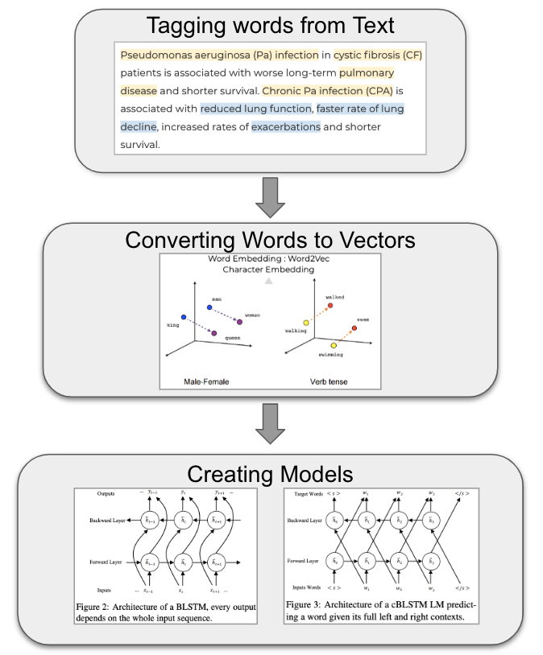
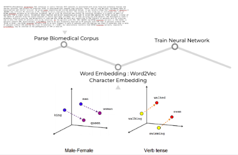
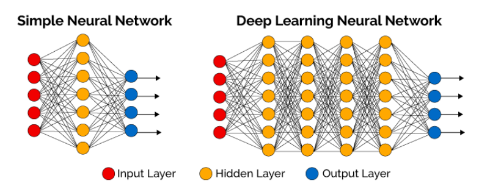
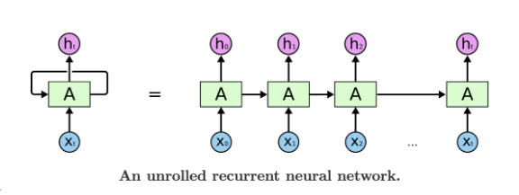
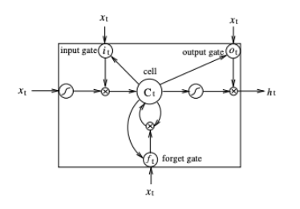
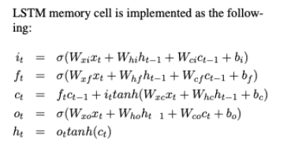
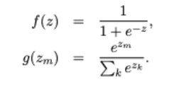
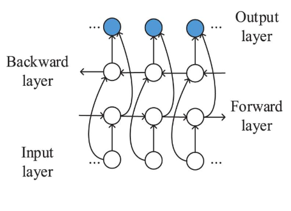

## **1. What is Natural Language Processing?**  

> Natural Language Processing (NLP) is a field in machine learning with the ability of a computer to understand, analyze, manipulate, and potentially generate human language [1].

>NLP can help with many tasks and can applicable to a variety of fields. For example, NLP enables the recognition and prediction of diseases based on electronic health records and patient’s own speech. This capability is being explored in health conditions that go from cardiovascular diseases to depression and even schizophrenia. For example, Amazon Comprehend Medical is a service that uses NLP to extract disease conditions, medications and treatment outcomes from patient notes, clinical trial reports and other electronic health records [2]. 
>
## **2. What is NER?**
 
>Name Entity Recognition (NER) plays a major role in the semantic part of NLP, which extracts the meaning of words, sentences and their relationships [1]. NER is able to locate entities in a text and label it based on predefined categories. Some examples of entities are, “person”, “organization”, “place”, or even a biomedical term. For example, NER can recognize that “pancreatic cancer” is a disease and “reduced lung function” is a symptom. NER plays an important role in enabling machines to understand a text. 
 
## **3. Steps in Classification**
  > ### Overview of Classification:
  
     

>### **3.1 Tagging Words from Text** 

>First, NER classifies the words in the given text into predefined categories.
>### **3.2 Converting Words to Vectors** 
 >
 
>This image describes the general outline from converting text to vectors based on associativity, which is then applied to train the neural network/input. A neural network is a computing system created from interconnected nodes that process information and inputs.
 
 >#### Word2Vec
 > - Machine Learning models take matrices as input; therefore, we need to convert every word in the text into a vector and represent them in vector space. 
 > - One common Word2Vec model is the Skip-Gram Model. This word vectorization method represents semantic connections between words. Word vectorization methods provide Distributional Similarity Based Representation, which states you can get a lot of value by representing a word by means of its neighbors. 
 > - A Skip-Gram Model uses the current word to predict its neighbors (its context). 
 > - We train the neural network by feeding it word pairs found in documents. The network is going to learn the statistics from the frequency of each pairing ( number of times each pairing shows up).
 > - The result of this model is that the words appearing in similar contexts in these texts are represented by proximal vectors. 

>### **3.3 Creating Models** 
>>#### What is a Neural Network?
>>A computing system made up of a number of simple interconnected nodes (processing elements), which processes information by their dynamic state response to external inputs.
 
 >>
 
 >>The input layer receives various forms of information from the outside world. This is the data that the network aims to process or learn about. From the input unit, the data goes through one or more hidden units. The hidden unit’s job is to transform the input into something the output unit can use.
    
 >>#### ***Recurrent Neural Network***
 >> Recurrent neural networks are networks with loops in them, allowing information to persist. Some common occurrences of RNNs are in translation, image captioning, and more.  RNNs combine the input vector with their state vector with a fixed (but learned) function to produce a new state vector [4].
    
 
 >>>
 
>>> As you can see in the unrolled version, the model first takes the x(0) from the sequence of input and then it outputs h(0) which together with x(1) is the input for the next step. So, the h(0) and x(1) is the input for the next step. Similarly, h(1) from the next is the input with x(2) for the next step and so on. This way, it remembers the context while training. This method of remembering past processed data is extremely useful when we want our model to have context from previous input.
 
 >>#### ***Long Short-Term Memory (LSTM)***
 >>LSTMs are a type of RNN; specifically a LSTM’s hidden layer updates are replaced by purpose-built memory cells. As a result, they may be better at finding and preserving long range dependencies of text. 
 
 >>#### ***Bi-Directional Long Short-Term Memory (LSTM)***
 >>Bi-LSTM’s are a combination of two LSTMs; one LSTM processing the data from front to end (Forward Layer) and one LSTM processing the data end to from (Backward Layer). Because Bi-LSTM’s read and analyze the input data in both the forward and reverse direction, the model is able to learn more relationships between the words. Bi-LSTMs find the probability of a word based on its full left and right contexts is ideal for maximizing the possibility of correctly clustering key phrases of symptoms, diseases, and/or treatments for a specific condition [5].
 >>
>  

> 

>>As mentioned previously, RNN introduces the connection between the previous states and current state. The recurrent layer is designed to store history information. The values in the hidden and output layers are computed as follows: 
>
>>h(t) = f(Ux(t) + Wh(t − 1)) 

>>y(t) = g(Vh(t))

>>where U, W, and V are the connection weights to be computed in training time, and f(z) and g(z) are sigmoid and softmax activation functions as follows:  
  
 
 >>###### ***A Long Short-Term Memory Cell***
 >>The image below illustrates a single LSTM memory cell, as well as provides the equations needs to implement the following cell. 
 
 >>
 
 ## **4. Applications** 
 - NLP text mining helps maximize the information we get out of electronic health records, by finding patterns and concepts within the data that humans cannot identify with the bare eye.
 - Clinical documentation using electronic health records allows NLP to be applied in the healthcare industry, improving healthcare delivery, disease diagnosis and affordability [1]. 
 - More specifically, NLP is a useful technique for precision medicine
  - NLP enables recognition and prediction of diseases based on electronic health records and patient’s own speech
  - Organizes unstructured data in health record databases, giving physicians more information about the data for decision making [6].
 - Amazon Alexa, which uses NLP technology, has collaborated with Britain’s National Health Service (NHS) to provide medical advice to its users [7].
 
 > #### **4.1 Case Study: Pharmacogenetic Studies** 
 >- Natural language processing algorithms were used to develop a weekly dose calculation system by extending an existing medication information extraction system “to extract drug-dose information from clinical text, and to assess the capabilities of such tools to automate the data-extraction process for pharmacogenetic studies.” [9]
 > - This study was done specifically on warfarin:
  > - The experiment consisted of 1125 patients with a stable warfarin dose
  >  - 776 of which who were managed by Coumadin Clinic physicians
   >  - 349 of which who were managed by their providers
 > - Two natural language processing algorithms were developed to extract weekly warfarin doses form both data sets 
  >  - One regular expression (RegEx) based program for Coumadin Clinic notes which achieved:
  >    - 100% recall, 97.4% precision, 97.5% accuracy
  >  - And one MedEx-based program as a weekly dose calculator for narrative providers’ notes which achieved:
  >    - 99.7% recall, 90.8% precision, 93.8% accuracy
  >- Evaluation of these results showed that the algorithms performed well in extracting and capturing weekly doses of warfarin. This shows that bioinformatics algorithms have large potential to increase efficiency and speed of data extraction processes of pharmacogenetic studies. 
 # **Referrences**
 [1] Yse, Diego Lopez. “Your Guide to Natural Language Processing (NLP).” Medium, Towards Data Science, 30 Apr. 2019, towardsdatascience.com/your-guide-to-natural-language-processing-nlp-48ea2511f6e1. 
 
 [2] Shetty, Badreesh. “Natural Language Processing(NLP) for Machine Learning.” Medium, Towards Data Science, 24 Nov. 2018, towardsdatascience.com/natural-language-processing-nlp-for-machine-learning-d44498845d5b. 
 
 [3] Wang, Zixu, et al. “Is Artificial Data Useful for Biomedical Natural Language Processing Algorithms?” Proceedings of the 18th BioNLP Workshop and Shared Task, 2019, doi:10.18653/v1/w19-5026. 
 
 [4] Mousa, Amr, and Björn Schuller. “Contextual Bidirectional Long Short-Term Memory Recurrent Neural Network Language Models: A Generative Approach to Sentiment Analysis.” Proceedings of the 15th Conference of the European Chapter of the Association for Computational Linguistics: Volume 1, Long Papers, 2017, doi:10.18653/v1/e17-1096. 
 
 [5] Banerjee, Suvro. “An Introduction to Recurrent Neural Networks.” Medium, Explore Science & Artificial Intelligence, 19 Aug. 2019, medium.com/explore-artificial-intelligence/an-introduction-to-recurrent-neural-networks-72c97bf0912. 
 
 [6] “Top 12 Use Cases of Natural Language Processing in Healthcare.” Maruti Techlabs, 2 Dec. 2019, marutitech.com/use-cases-of-natural-language-processing-in-healthcare/. 
 
 [7] Magra, Iliana. “Alexa Now Gives U.K. Users N.H.S. Medical Advice.” The New York Times, The New York Times, 10 July 2019, www.nytimes.com/2019/07/10/world/europe/alexa-nhs-amazon-privacy.html. 
 
 [8] “Sequence Tagging with Tensorflow.” Guillaume Genthial Blog, 5 Apr. 2017, guillaumegenthial.github.io/sequence-tagging-with-tensorflow.html. 
 
 [9] Hua Xu, Min Jiang, Matt Oetjens, Erica A Bowton, Andrea H Ramirez, Janina M Jeff, Melissa A Basford, Jill M Pulley, James D Cowan, Xiaoming Wang, Marylyn D Ritchie, Daniel R Masys, Dan M Roden, Dana C Crawford, Joshua C Denny, Facilitating pharmacogenetic studies using electronic health records and natural-language processing: a case study of warfarin, Journal of the American Medical Informatics Association, Volume 18, Issue 4, July 2011, Pages 387–391, https://doi.org/10.1136/amiajnl-2011-000208 
 
 

 

