# An Analysis of Clustering Methods in Bioinformatics: k-means and hierarchical clustering
**Authors**
- k-means Clustering: Jeffrey Sardina
- Hierarchical Clustering: Dengxiaoyu Shi

**Section Information**
- Written Fall 2019 as a part of Professor Sheng Zhong's BENG 183 class.

# Contents
1. [K-Means Clustering](#1)
2. [Hierarchical Clustering](#2)
3. [Comparison of the Methods](#3)

# 1 k-means Clustering<a name="1"></a>
## Contents
1. [Introduction](#1.1)<br>
    1.1. [Main Points of this Chapter](#1.11)<br>
    1.2. [Definition of the Clustering Problem](#1.12)<br>
    1.3. [ Importance of the Clustering Problem](#1.13)<br>
2. [The k-means Algorithm](#1.2)<br>
    2.1. [Algorithm Outline](#1.21)<br>
    2.2. [Properties of k-means](#1.22)<br>
    2.3. [Best-case of k-means](#1.23)<br>
    2.4. [Sources of Inaccuracy](#1.24)<br>
    2.5. [Worst-case of k-means](#1.25)
3. [Applying k-means: Cancer Detection](#1.3)
4. [References](#1.4)

## 1 Introduction<a name="1.1"></a>
### 1.1 Main Points of this Chapter<a name="1.11"></a>
The goal of this chapter is to demonstrate the that k-means clustering algorithm works well for clustering data based on location (i.e., amorphous blobs of points) but fails on data clusters associated by patterns in space (i.e., a series of concentric circles).

The main points to be covered in the chapter are as follows:
- Pros of k-means:
    - Good results for clustering blobs of data points
    - always produces the desired number, k, of clusters
- Cons of k-means:
    - Initialization bias: the initialization of the function biases the final result
    - Cannot classify data based on patterns

The remainder of the introduction will be dedicated to an overview of the clustering problem, as well as why understanding it matters in the field of bioinformatics.

## 1.2 Definition of the Clustering Problem<a name="1.12"></a>
In general terms, the clustering problem is as follows: given a set of data points, divide the data points into k-many similar groups [3]. Ideally, every group should have very high similarity of data points within itself, and be maximally different from all of the other groups [3].

It is important to note that finding the perfect, ideal clustering arrangement for a given set of data is computationally infeasible for large data sets [3]. All clustering algorithms trade some accuracy for the ability to finish clustering in a reasonable amount of time. Thus, no clustering output is authoritative: while it may be very accurate, it represents a local optimum and not necessarily a global optimum [3].

## 1.3 Importance of the Clustering Problem<a name="1.13"></a>
The clustering problem has very important applications to machine learning and prediction algorithms. For example, consider a case in which you have already three clusters of gene expression data: one belonging to healthy cells, one to breast cancer cells, and one to lung cancer cells. If a samples from a new patient comes in, you can plot its gene expression levels on the same graph and determine which cluster best describes it. This gives a molecular diagnosis of the patient's condition. Clearly, having these clusters is of great value.

But in that example, we assumed we already knew the boundaries of our clusters. What if, however, we had data and needed to determine where the boundary between each cluster is? This is where clustering algorithms come in. They allow us to define where these boundaries are, so we have and idea as to where to set the cut-off between healthy and cancerous cells. In short, a clustering algorithm tells us which points do and do not belong to a given class.

## 2 The k-means Algorithm<a name="1.2"></a>
### 2.1 Algorithm Outline<a name="1.21"></a>
The k-means algorithm has three main phases: initialization, iteration, and termination [3]. The initialization step consists of choosing initial centroids for the first set of clusters [3]. Each iteration moves those centroids to the center of their cluster and the recalculates clusters, thereby moving each center closer to the points it represents [3]. Once all the clusters stop updating, the algorithm is said to have converged and the clusters it found are returned [3].

Pseudocode [3]:
```
#k is the number of clusters wanted
function kmeans(k, dataSet)
    #Initialization
    choose k random data points from the dataSet to use as initial centroids

    #Iteration
    Repeat until the clusters do not change:
        Assign every point to a cluster based on the centroid it is closest to
        Update centroids to be the arithmetic mean point of all points in their set

    #Termination
    Return the k-many final clusters
```

It is very common that the algorithm will run multiple initialization steps and only proceed with the one that gives it the best initial clusters [4]. This helps prevent initial centroid locations form biasing the results, which makes k-means overall more accurate [4]. (The 'best stating clusters' are determined checking the distance of points in a cluster form its center. THe smaller the total distance is, the better).

### 2.2 Properties of k-means<a name="1.22"></a>
The k-means algorithms has several key properties:
- Non-deterministic output: since k-means uses random initialization of data points, it can over many different runs produce different results [3, 4]. Choosing better starting points, or doing more random initializations, helps make these different results more and more similar to each other [4].
- Mean-based clustering: By the definition of the k-means algorithm, K-means cares only for central points that describe date, not taking into account geometric patterns [3].

### 2.3 Best-case of k-means<a name="1.23"></a>
The best case of k-means is when clusters can be identified by similarity to a given set of characteristics, rather than a pattern in those characteristics. In this case, clusters are centered on a single point in, with other data points scattered around them. k-means tends to converge close to the center of clusters, and so by doing so it tends to pick up on the point that best describes the characteristics of its cluster.

Formally, the best case occurs when k-means optimally clusters all points such that no other configuration of k-clusters could produce cluster centers closer to a greater number of data points [3]. This means that the local optimum found by the algorithm would be a global optimum, and that the clustering could not be improved [3].

We can see idea behavior in the following example. Let's say that we generate 4 random clusters, shown below in different colors:<br>
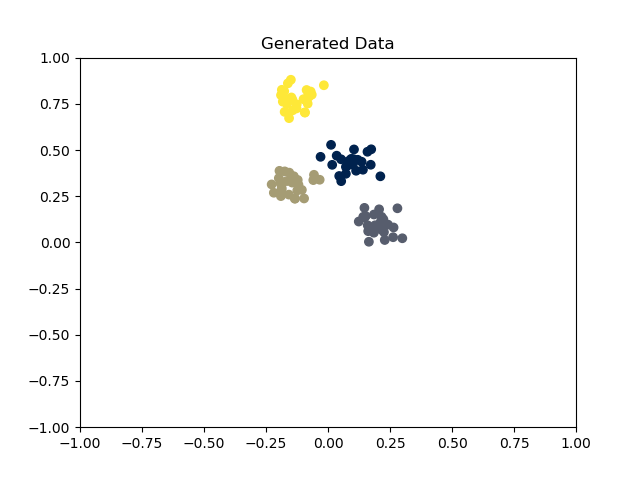

We then remove all labelling data and run k-means on those points:<br>
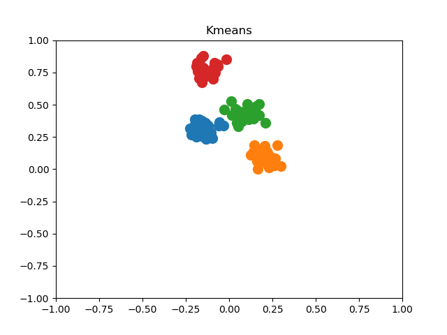

K-means successfully categorized all data according to its cluster, with all clusters exactly the same as the starting clusters! Unfortunately, however, it's not always this easy.

### 2.4 Sources of Inaccuracy<a name="1.24"></a>
The major sources of inaccuracy in k-means come directly from being non-deterministic: since random points are used to initialize the data, unlucky results (random initial points that far from any true clusters) can bias the final outcome and make the algorithm produce a solution that does not accurately represent the data [4]. This is double a problem when multiple phases of initialization are used, since a single centroid generated in the beginning can bias the entire algorithm [4].

Let's take a look at how k-means does with as the number of initialization trials varies. Here is the true data:<br>
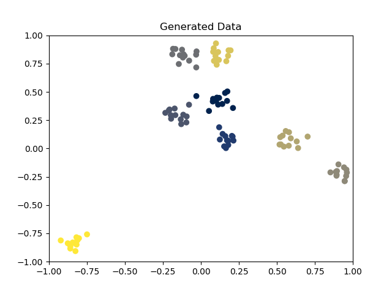

To start, we only initialize once:<br>
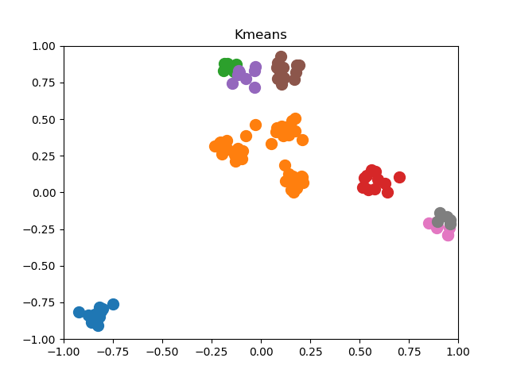

Now let's initialize twice:<br>
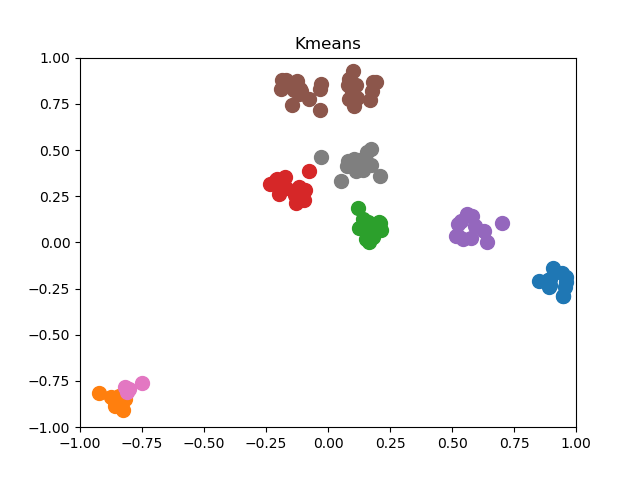

And thrice:<br>
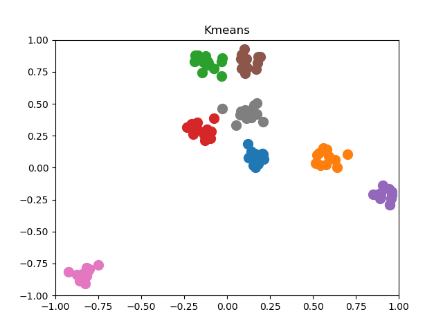

Now 5 times:<br>
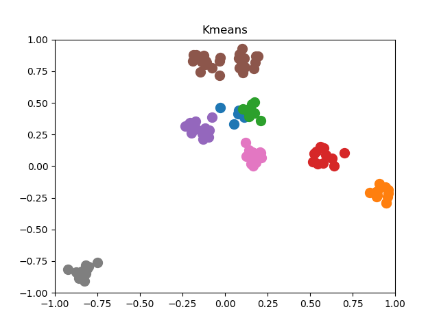

Now 10 times:<br>
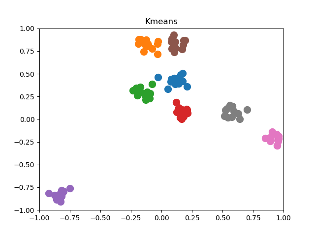

And now 100 times:<br>
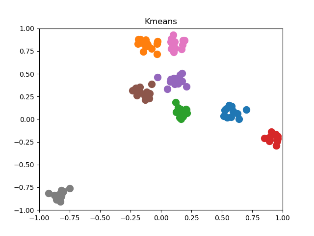

Finally 1000 times:<br>
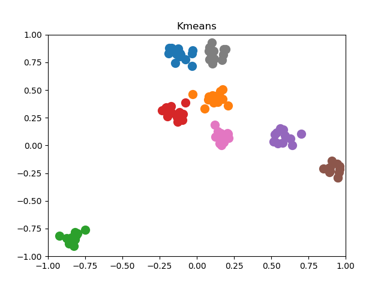

There are a few important points to take away from this. First, more random initializations is better. Quality generally improves for each added initialization round.

However, more initialization is inly probabilistically going to dive better results: nothing is guaranteed. Look, for example, when the number in initializations was 3. This actually identified all the clusters, but when 5 initializations were run, the result was worse. Why? Simply random chance. Note, however, that all of the 10, 100, and 1000 samples clustered the data the same. As the number of trial rounds gets very large, the chance of having a deviation from good results decreases--to the point that no more variations were event here.

In this section, not that we still used blobs of data. But what happens when you input obviously pattered data?

### 2.5 Worst-case of k-means<a name="1.25"></a>
THe worst case of k-means occurs when it is given data that cannot by described by proximity to a single point [5]. Such data is often data with spatial patterns, rather than blobbing of data p[5]. Take, for instance, the below data set:<br>
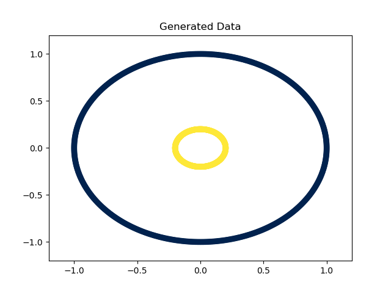

Now we'll let k = 2 clusters, and initialize 100 times with random points. K-means outputs the following:<br>
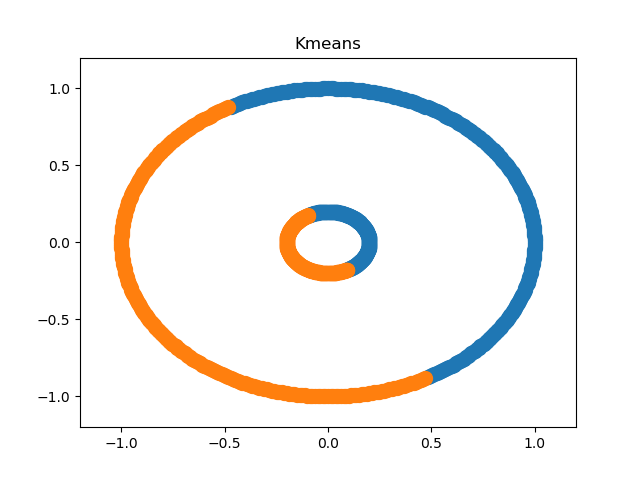

That seems a bit wrong, doesn't it? The data in question are perfect circles, yet k-means cannot pick up on the pattern at all. It simply looks for a single center, not a distribution of points with a common underlying pattern.

As we can see here, k-means should never be used in a case where clusters are defined by a pattern. If and only if data are clustered around a single mean point can k-means be used reliable. Luckily, however, many scientific applications of clustering--such as the cancer detection example explained below--rely on data that clusters into groups defined by a mean. But it is important to remember that not all data will be thus, and when data does not cluster around a mean, k-means should not be applied.

## 3 Applying k-means: Cancer Detection<a name="1.3"></a>
K-means is commonly used in research applications as a part of data analysis pipelines [1, 2]. For the remainder of this chapter, we will examine a specific case of the application of the k-means algorithm: detecting the presence of acute lymphoblastic leukemia (ALL) in a digital image form microscopy [1].

In short, the researcher' goal was to automate the classification of cells into healthy or ALL cells, using the following pipeline:
- cell images => conversion to a easily readable form => k-means clustering to separate nuclei from the image background => detection of features on the nuclei => cell classification
[1].

The images were encoded by their hue, saturation, and value numbers (collectively called HSV encoding); the (H, V) data points were interpreted 2-D coordinates and run in a 2-D k-means clustering much like the examples shown above [1]. The input image and output results are reproduced below:

The original, HSV-encoded image [1]:<br>


After k-means clustering, the following nuclei were extracted from the image [1]:<br>
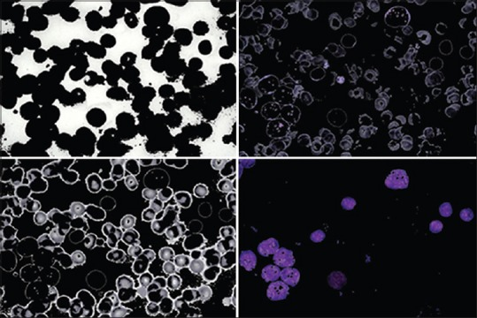

The experimenters did this by clustering pixels according to their (H, V) values [1]. By tracing which pixels end up in which clusters, they were able to find which areas of the image were most similar in (H, V) color and which were more different, forming their k clusters [1]. Once images were clustered, the researchers were able to use the extracted nuclei to classify the cells as cancerous or healthy (using a separate clustering system, called SVM) [1].

## 4 References<a name="1.4"></a>
1. Amin, Morteza Moradi et al. “Recognition of acute lymphoblastic leukemia cells in microscopic images using k-means clustering and support vector machine classifier.” Journal of medical signals and sensors vol. 5,1 (2015): 49-58. 

2. Kim, SungHwan. “Weighted K-means support vector machine for cancer prediction.” SpringerPlus vol. 5,1 1162. 25 Jul. 2016, doi:10.1186/s40064-016-2677-4

3. Hartigan, J. A., and M. A. Wong. “Algorithm AS 136: A K-Means Clustering Algorithm.” Journal of the Royal Statistical Society. Series C (Applied Statistics), vol. 28, no. 1, 1979, pp. 100–108. JSTOR, www.jstor.org/stable/2346830.

4. Hamerly, Greg and Charles Elkan. “Alternatives to the k-means algorithm that find better clusterings.” CIKM (2002).

5. Martin Ester, et al. "A density-based algorithm for discovering clusters in large spatial databases with noise." AAAI Press.

# 2 Hierarchical Clustering<a name="2"></a>
## Contents
1. [Introduction](#2.1)<br>
2. [The Hierarchical Clustering Algorithm](#2.2)<br>
    2.1. [Algorithm Outline](#2.21)<br>
    2.2. [Advantages of Hierarchical Clustering and Its Application in Bioinformatics](#2.22)<br>
    2.3. [Disadvantages of Hierarchical Clustering](#2.23)
3. [Different Types of Linkage in Hierarchical Clustering](#2.3)<br>
    3.1. [Overview and Discussion of Runtime](#2.31)<br>
    3.1. [Advantages and Disadvantages of Different Types of Linkage](#2.32)<br>
    3.1. [Case Study on Gene Expression Data](#2.33)
4. [References](#2.4)

## 1 Introduction<a name="2.1"></a>
Hierarchical clustering is a method of cluster analysis which seeks to build a hierarchy of clusters. [1] The algorithm combines two similar objects into one cluster. And will finally generate set of clusters, where each cluster is distinct from each other cluster, and the objects within each cluster have the largest similarity to each other.

There are two different strategies that can be used to perform hierarchical clustering – “Agglomerative” and “Divisive”. The one that is usually performed in Bioinformatics is “Agglomerative”. The Agglomerative strategy is a “bottom-approach”, which means that we begin by defining each observation as its own cluster, the merge two clusters as one and move up.

## 2 The Hierarchical Clustering Algorithm<a name="2.2"></a>
### 2.1 Algorithm Outline<a name="2.21"></a>
The Hierarchical clustering algorithm has three steps: 
1. Assign each observation to its own cluster.
2. Compute the similarity between each of the clusters and join the two most similar clusters.
3. Repeat steps 1 and 2 until there is only one cluster left

### 2.2 Advantages of Hierarchical Clustering and Its Application in Bioinformatics<a name="2.22"></a>
Hierarchical clustering has significant advantages in two aspects. First, we do not need to make assumptions of the specific number of clusters. Which means that we can pick the final number of clusters we want by selecting the specific step of the algorithm containing the number of clusters we want. Second, the way hierarchical clustering works may correspond to a meaningful taxonomy base on what dataset we are using.

Because of its advantages in these two aspects, hierarchical clustering is good at clustering data at an experimental level, base on “pairwise statistical comparison of complete scatterplots rather than individual gene sequences”. [3] For example, hierarchical clustering is good at grouping and visualizing expressions based on a coefficient matrix created by groups of level of expressions.

In biological research, hierarchical clustering is used in “making known the natural structure inherent in gene expression data, understanding gene functions, cellular processes, and subtypes of cells, mining useful information from noisy data, and understanding gene regulation”. And it has a benefit in “identification of homology” as well. [4]


### 2.3 Disadvantages of Hierarchical Clustering<a name="2.23"></a>
Hierarchical clustering for sure has some draw backs. First, the interpretation of the algorithm can be complex, and the runtime is slow. As we will see in section 3.1, the time complexity of hierarchical clustering is relatively slow, especially when comparing to other clustering algorithms like k-means.

Second, it cannot go back and change the cluster that was decided earlier by the algorithm. As a result, hierarchical clustering has a tendency to make insignificant clusters when talking about genetic level clustering. And k-means and SOMs have a significant advantage on identifying meaningful genetics differences between observations over hierarchical. [3]

## 3 Different Types of Linkage in Hierarchical Clustering<a name="2.3"></a>
### 3.1 Overview and Discussion of Runtime<a name="2.31"></a>
The word linkage in hierarchical clustering points to how the distance between two clusters is calculated. There are many types of linkage existed. And here we will introduce and compare four common types of linkage that are provided by python - average-linkage, single-linkage, compete-linkage and ward-linkage. And the runtime of hierarchical clustering is mainly depending on what type of linkage is used. 

In the worst case, merging all the clusters takes O(n) for any type of linkage. The difference between time complexity of hierarchical clustering is depending on how they compare the two clusters, in another word, what type of linkage is used.

Average-linkage is the type of linkage which calculate the distance between clusters by calculating the average distance between each point in one cluster to every point in other cluster. Single-linkage calculate the distance between two clusters by calculating the shortest distance between two points in each cluster. Complete-linkage calculate the distance between two clusters by calculating the longest distance between two points in each cluster. And ward linkage is the linkage calculating distance by calculating the sum of squared differences within all clusters.

Among them, Average-linkage and ward-linkage have the slowest runtime of  O(n^3), and the other two has a faster runtime of O(n^2 log n).

### 3.2 Advantages and Disadvantages of Different Types of Linkage<a name="2.32"></a>
Single-linkage and complete-linkage have a faster runtime. However, they have their own drawbacks. The clusters result from single-linkage could be too separate, as there only needs to have one pair of objects to be close in order to merge two clusters. In the meanwhile, the clusters from complete-linkage could be too compact, as the merging is depending on the worst-case similarity of pairs of objects between two cluster. 

Average-linkage also has its own drawbacks. First, when we cut the tree to have selected number of clusters, it is not clear what properties the cut is based on. Second, moving of a single element in the dataset can cause a large shift in the final clustering.
Ward-linkage makes clusters that minimizing intra-cluster variation and maximizing inter-cluster variation [5], which may be a problem on some datasets.


### 3.3 Case Study on Gene Expression Data<a name="2.33"></a>
In order to briefly measure the accuracy of different types of linkage of hierarchical clustering on gene expression, here we started a case study of hierarchical clustering on gene expression cancer RNA-Seq data set from UCI data repository [6]

From the labels provided by the dataset, we know that the proximal number of the clusters for this dataset is 5. So here we cut the dendrogram at the layer containing 5 clusters.

Here is result of ward-linkage:<br>
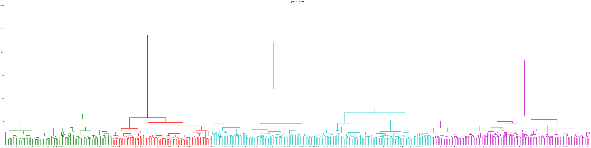
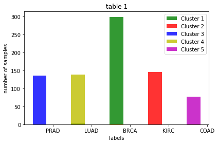

|         | Cluster 1| Cluster2 | Cluster 3 | Cluster 4 | Cluster 5 |
|---------|:--------:|---------:|-----------|:---------:|----------:|
|PRAD     | 0|0|136|0|0|
|LUAD     | 2|0|0|1|0|
|BRCA     | 299|0|0|1|0|
|KIRC     |0|146|0|0|0|
|COAD     |2|0|0|139|0|

Here is the result of average-linkage:<br>
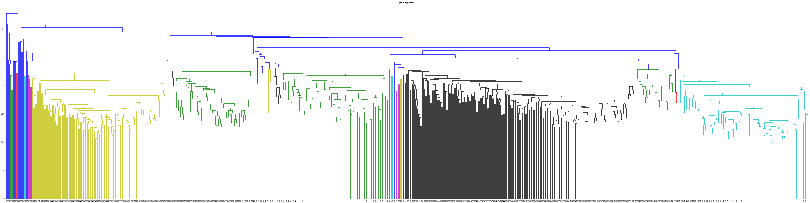
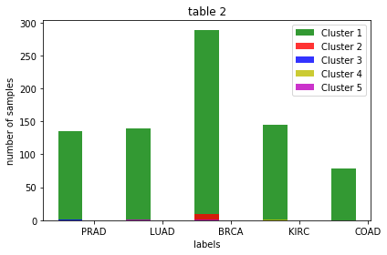

|         | Cluster 1| Cluster2 | Cluster 3 | Cluster 4 | Cluster 5 |
|---------|:--------:|---------:|-----------|:---------:|----------:|
|PRAD     |  135	|0	|1	|0	|0|
|LUAD     |  140	|0	|0	|0	|1|
|BRCA     |  289	|10	|0	|0	|1|
|KIRC     |  145	|0	|0	|1	|0|
|COAD     |140	|0	|0	|0	|1|

Here is the result of single-linkage:<br>
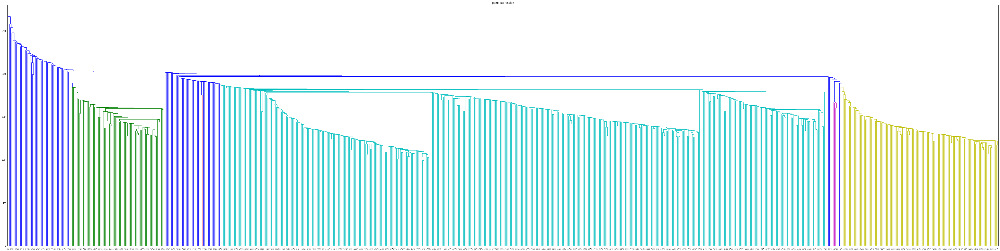
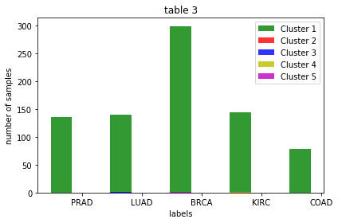

|         | Cluster 1| Cluster2 | Cluster 3 | Cluster 4 | Cluster 5 |
|---------|:--------:|---------:|-----------|:---------:|----------:|
|PRAD     | 136|0|0|0|0|
|LUAD     | 140|0|1|0|0|
|BRCA     | 299|0|0|0|1|
|KIRC     | 144|1|0|1|0|
|COAD     | 140|0|1|0|0|

Here is the result of complete-linkage:<br>
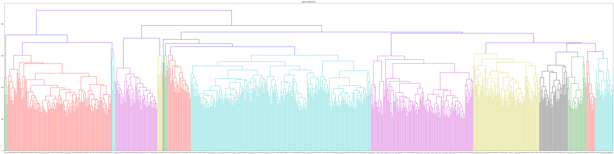
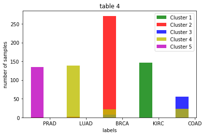

|         | Cluster 1| Cluster2 | Cluster 3 | Cluster 4 | Cluster 5 |
|---------|:--------:|---------:|-----------|:---------:|----------:|
|PRAD     | 0|1|0|0|135|
|LUAD     | 0|2|0|139|0|
|BRCA     | 0|271|7|22|0|
|KIRC     | 146|0|0|0|0|
|COAD     | 0|2|0|139|0|


From the result above, we can see that the ward-linkage gives the best result with minor mistakes, and complete-linkage also gives a good result with less 3% samples being mistakenly clustered. Average-linkage and single-linkage all give results that clustered almost all the samples into a single cluster. 

The results point out the fact that ward-linkage and complete-linkage fit better with this data set, while average and single do not. However, as the ward linkage will maximize inter-cluster variation, and complete-linkage tend to form compact clusters with approximately equal diameters [7], it is hard for us to find what makes them fit with this data set. After all, what we can see is that there is not a single criterion on what types of linkage fits best for the dataset we want to cluster. In order to figure out what fits well, we may need to test multiple types of linkage instead of selecting one of them base on assumptions.

## 4 References<a name="2.4"></a>
1. Rokach, Lior, and Oded Maimon. "Clustering methods." Data mining and knowledge discovery handbook. Springer US, 2005. 321-352.

2. https://www.saedsayad.com/clustering_hierarchical.htm

3. Bioinformatics in the Post-Genomic Era: Genome, Transcriptome, Proteome, and Information-Based Medicine. Jeff Augen. Informit (http://www.informit.com/articles/article.aspx?p=357695&seqNum=4)

4. Oyelade, Jelili et al. “Clustering Algorithms: Their Application to Gene Expression Data.” Bioinformatics and biology insights vol. 10 237-253. 30 Nov. 2016, doi:10.4137/BBI.S38316

5. Strauss, Trudie, and Michael Johan von Maltitz. “Generalising Ward's Method for Use with Manhattan Distances.” PloS one vol. 12,1 e0168288. 13 Jan. 2017, doi:10.1371/journal.pone.0168288

6. https://archive.ics.uci.edu/ml/datasets/gene+expression+cancer+RNA-Seq#
 
7. Everitt, Landau and Leese (2001), pp. 62-64.

# Comparison of the Methods<a name="3"></a>
## Contents
1. [The Clustering Philosophy of the Algorithms](#3.1)
2. [The Termination of the Algorithms](#3.2)
2. [General Cases of Applications in Bioinformatics](#3.3)
3. [References](#3.4)

## The Clustering Philosophy of the Algorithms<a name="3.1"></a>
Both K-means and hierarchical clustering have the same underlying basis: that data-points belonging to the same cluster will have a small distance from each other in space. Thus, both have no regard for other patterns in data, and would fail to identify two concentric circles (as seen before) as belonging to distinct clusters.

## The Termination of the Algorithms<a name="3.2"></a>
As mentioned in the previous chapters, hierarchical clustering is always guaranteed to have a fixed termination time because it runs until all points have been clustered; on the other hand, k-means does not have such an easily defined point of termination. Because the first round of k-means separates the data into k clusters immediately, the same metric cannot be used. In many cases, there is no convergence and so the algorithm must estimate when the clustering is complete [1]. From this, we can notice a critical difference between the algorithms: Based on initialization, k-means can be forced to terminate at a relatively poor point, whereas hierarchical clustering will always terminate the same way for a given data set. When deciding which algorithm to apply, this should always be considered.

## General Cases of Applications in Bioinformatics<a name="3.3"></a>
The of k-means ability to re-revaluate clusters later and update them gives it a stark advantage over hierarchical clustering on the same dataset in many scenarios [2]. For example, k-means is very commonly applied to clustering genetic oncology data [2].One of the benefits of this case, however, is that in oncology the number of clusters is known: it is the number of patient groups from which data is drawn. Thus, k-means can be given a number of clusters, k, that is known to be correct. It is in these cases that k-means performs best: when the number of clusters to be found is known [2].

Hierarchical clustering is applied in other cases, such as where the end-goal is to separate groups based on their level of response to given treatments [2]. For example, the response of different groups to different cancer treatments produces data that could be clustered using hierarchical methods quite well [2]. Note that in this case defining exactly how many groups there must be is of lesser concern then identifying the relative response levels of different groups. Since hierarchical clustering allows evaluating groups of different sizes based on where the dendrogram is cut, the exact number of clusters does not have as much meaning as it does in k-means.

## 4 References<a name="3.4"></a>
1. Hamerly, Greg and Charles Elkan. “Alternatives to the k-means algorithm that find better clusterings.” CIKM (2002).

2. Bioinformatics in the Post-Genomic Era: Genome, Transcriptome, Proteome, and Information-Based Medicine. Jeff Augen. Informit (http://www.informit.com/articles/article.aspx?p=357695&seqNum=4)
