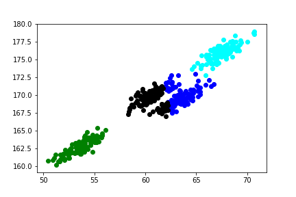
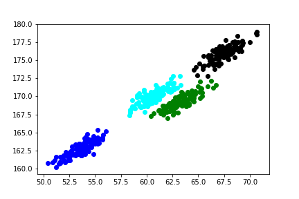

# Final Report (//TODO)

## By Hanqing Zhao, Jianing Wang, Shihui Zhu

* [Overview](#overview)

* [K-Means Clustering](#k-means-clustering)

* [Global K-Means Clustering](#global-k-means-clustering)

## Overview

Clustering is a really useful machine learning technique for analyzing all kinds of data. It can help us to group certain data points that have similar properties in a large dataset, in order to grab information from it. In biological research, we often obtain lots of data from the experiments. In order to shuffle the useful information from the sea of data, it is crucial for us to correctly interpret the patterns behind it using clustering. We can use clustering method in gene expression data obtained from RNA sequencing, to discover potential groups of genes and samples, and predict the unknown functions of genes.
In this report, we are going to expand on what we have learned about k-means clustering in the class, introduce global k-means, fuzzy c-means clustering, and Mixture of Gaussian clustering methods. Additionaly, we will discuss how they are different and useful in genomic data analysis.

## *K*-Means Clustering

K-means clustering is a clustering algorithm that essentially partitions all data points into k clusters with locally optimal within-cluster sum of squared Euclidean distances1. The standard algorithm starts with a given initial set of k cluster centers:  
Step 1: For each point, find its closest cluster center and assign it to the closest cluster.  
Step 2: Update the cluster centers to be the average of points contained within them.  
Step 3: Stop if the algorithm converges (that is, the cluster assignments no longer change). Otherwise, go to Step 1.

Here is a demo:


## Global *K*-Means Clustering

As mentioned, k-means clustering results are sensitive to the initial choice of clusters therefore they are only reliable for analyzing small sets of data. To improve it, auxiliary incremental approaches are recently introduced to k-clustering algorithm, which are known as the global k-means clustering.  

One traditional way is to start from one cluster (centroid), and continuously adding new clustering center as the iteration proceeds. 


```html

```


* $U^{(t)}$ = the fuzzy c-partition of all data points after $t^{th}$ iterations)
* $N$ = the number of data points
* $~c~$ = the number of cluster centers
* $d_{ij}$ = Euclidean distance between $i^{th}$ data point and $j^{th}$ cluster center
* $~v_i$ = the $i^{th}$ cluster center
* $~m$ = weighting component, *aka* the fuzzifier; $m \in (1,\infty)$
* $\mu_{ij}$ = membership of $i^{th}$ data point to $j^{th}$ cluster center
* $~y_k$ = the $k^{th}$ data point

$$ \mu_{ij} = \Big( \sum_{k=1}^c (d_{ij}/d_{ik})^{\frac{2}{m-1}} \Big)^{-1} $$

$$ v_i = \sum_{k=1}^N (u_{ik})^my_k \Big/ \sum_{k=1}^k (u_{ik})^m $$

$||U^{(t+1)}-U^{(t+1)}|| < \epsilon$

ee.<sup>superscript</sup> 


|      K-means          |  GMM |
|:------------------------|:----------------------------:|
|  |  |
| Fig. Comparison of clustering using k-means and Mixture of Gaussian. The plot |

| |
|:--|
| Fig. Comparison of average time for k-Means and FCM. The table on the top shows the average executation time by k-Means and FCM. The plot at the bottom shows average runtime of k-Means and FCM.|
